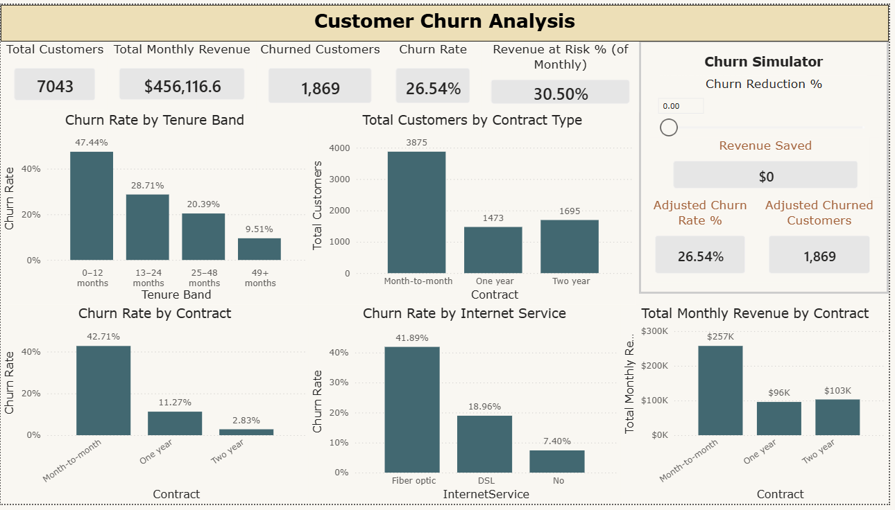
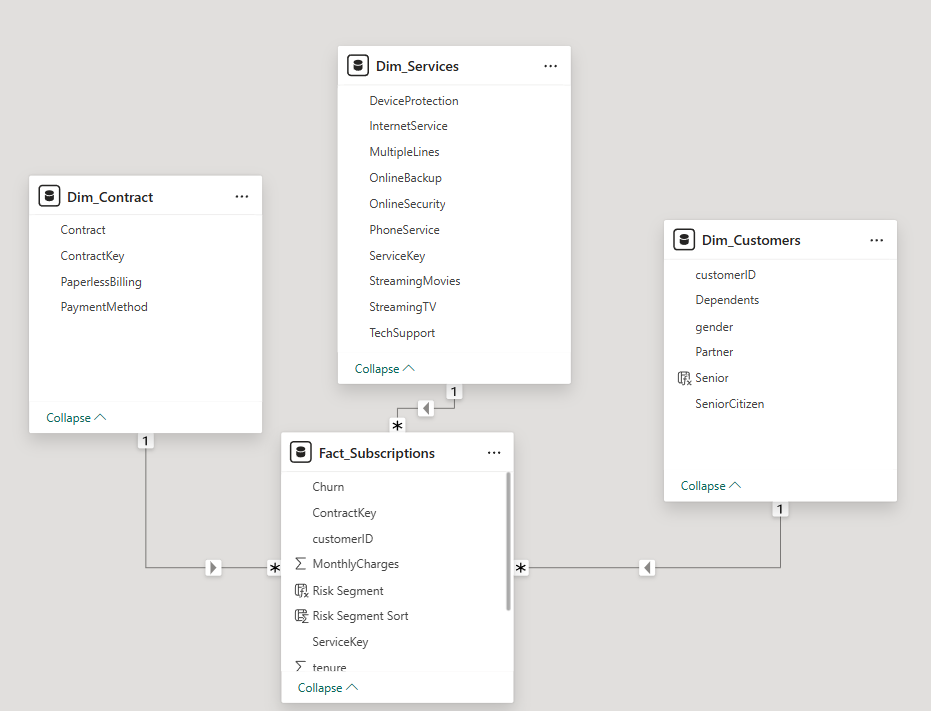
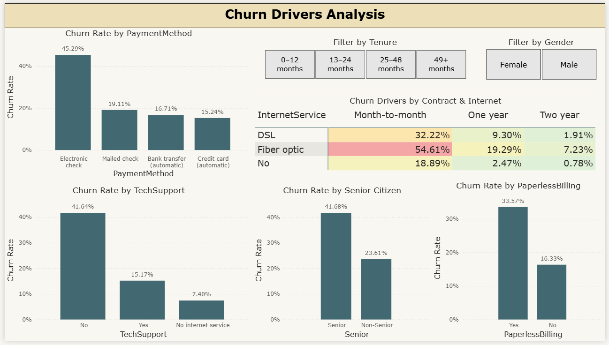
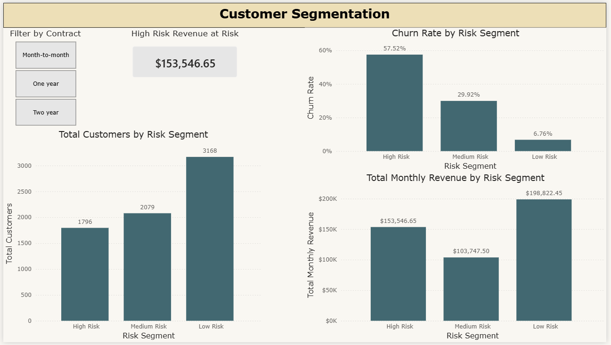

# Customer Churn Analytics Dashboard
A Multi-Page Power BI Project



---

## About This Project

This Power BI project analyzes customer churn behavior for a telecommunications company and translates the findings into actionable business insights.

The central business question is: **What drives customer churn, and how can we reduce its impact?**

Unlike a basic churn dashboard, this project goes further by implementing a star schema data model, rule-based customer segmentation, and an interactive churn reduction simulator — techniques that reflect how BI is actually done in practice.

**Dataset:** [Telco Customer Churn Dataset](https://www.kaggle.com/datasets/blastchar/telco-customer-churn), publicly available on Kaggle, 7,043 customer records, 21 columns.

---

## What You Will Learn

After finishing this project you will be able to:

- Build a star schema from a flat CSV file
- Use `RELATED()` to pull dimension attributes into fact table calculations
- Create rule-based calculated columns using `SWITCH(TRUE(), ...)`
- Write DAX measures organized in a dedicated measures table
- Implement a what-if parameter for scenario analysis
- Design a multi-page analytical dashboard with consistent layout
- Apply segmentation logic to prioritize business action

---

## Tools Required

- Microsoft Power BI Desktop (free), [Download here](https://powerbi.microsoft.com/desktop/)
- Kaggle account (free), to download the dataset

---

## Project Structure

```
Customer-Churn-Analytics/
├── churn_dashboard.pbix
├── README.md
└── Screenshots/
    ├── Data Model.png
    ├── Overview.png
    ├── Drivers.png
    ├── Segmentation.png
    └── Tooltip - Revenue at Risk.png
    └── Tooltip - Revenue at Risk.png
```

---

## Data Model

Rather than working from a single flat table, this project implements a **star schema** to improve scalability and analytical clarity.

!

**Fact Table**
- `Fact_Subscriptions` — one row per customer, contains churn status, monthly charges, tenure, and the foreign keys that connect to each dimension table

**Dimension Tables**
- `Dim_Customers` — demographic attributes (gender, senior citizen status, partner, dependents), connected via `customerID`
- `Dim_Contract` — contract type and billing preferences, connected via `ContractKey`
- `Dim_Services` — internet, phone, and add-on service subscriptions, connected via `ServiceKey`

**Relationships**
- `Fact_Subscriptions[customerID]` → `Dim_Customers[customerID]` (many-to-one)
- `Fact_Subscriptions[ContractKey]` → `Dim_Contract[ContractKey]` (many-to-one)
- `Fact_Subscriptions[ServiceKey]` → `Dim_Services[ServiceKey]` (many-to-one)

> **Why a star schema?** A flat table works fine for small, simple reports. But separating facts from dimensions makes the model easier to maintain, easier to extend, and signals to anyone who opens your file that you understand data modeling principles — not just how to drag fields onto a canvas.

> **Why surrogate keys (ContractKey, ServiceKey)?** Rather than joining every table through `customerID`, this model uses dedicated integer keys for `Dim_Contract` and `Dim_Services`. This is standard practice in data warehousing — surrogate keys are faster for joins and decouple the model from natural keys that could change in the source system. In Power BI, they also give you explicit control over which column defines the relationship.

> **Why many-to-one, not one-to-one?** The fact table sits on the "many" side of every relationship because it is the central table that references the dimensions. Each dimension record (one contract type, one service bundle) can in theory be shared by multiple customers. Power BI enforces referential integrity through this directionality, which also controls how filters flow between tables — filters always flow from the dimension (one side) into the fact table (many side), not the other way around.

> **Why RELATED()?** Since the segmentation logic needs attributes from `Dim_Contract` and `Dim_Services`, but the calculated column lives in `Fact_Subscriptions`, we use `RELATED()` to look up values across the relationship. This only works because the relationships are properly defined and filters flow in the correct direction.

---

## Step-by-Step Guide

### Step 1 - Download the Dataset
1. Go to the [Telco Customer Churn Dataset](https://www.kaggle.com/datasets/blastchar/telco-customer-churn)
2. Create a free Kaggle account if you do not have one
3. Download and extract the CSV file

---

### Step 2 - Load and Split the Data into a Star Schema

1. Open Power BI Desktop
2. Home tab -> Get Data -> Text/CSV -> select your file
3. Click **Transform Data** (not Load)
4. Rename the table to `Fact_Subscriptions`
5. Fix the `TotalCharges` column -- it imports as text because some rows contain spaces. Change its data type to Decimal Number. Power BI will convert blanks to null automatically.

Now create your dimension tables by duplicating and trimming the fact table:

**Dim_Customers:**
- Right-click `Fact_Subscriptions` in the Queries pane -> Duplicate
- Rename to `Dim_Customers`
- Keep only: `customerID`, `gender`, `SeniorCitizen`, `Partner`, `Dependents`
- Remove all other columns

**Dim_Contract:**
- Duplicate again, rename to `Dim_Contract`
- Keep only: `ContractKey`, `Contract`, `PaperlessBilling`, `PaymentMethod`

**Dim_Services:**
- Duplicate again, rename to `Dim_Services`
- Keep only: `ServiceKey`, `PhoneService`, `MultipleLines`, `InternetService`, `OnlineSecurity`, `OnlineBackup`, `DeviceProtection`, `TechSupport`, `StreamingTV`, `StreamingMovies`

**Fact_Subscriptions:**
- Remove all columns that now live in the dimension tables, keeping: `customerID`, `ContractKey`, `ServiceKey`, `tenure`, `MonthlyCharges`, `TotalCharges`, `Churn`

6. Click **Close and Apply**

---

### Step 3 - Define Relationships

In Model view, connect the tables using the appropriate keys:
- `Fact_Subscriptions[customerID]` → `Dim_Customers[customerID]` (many-to-one)
- `Fact_Subscriptions[ContractKey]` → `Dim_Contract[ContractKey]` (many-to-one)
- `Fact_Subscriptions[ServiceKey]` → `Dim_Services[ServiceKey]` (many-to-one)

The fact table sits on the many (*) side and each dimension sits on the one (1) side. This means filters flow from the dimension tables into the fact table — for example, selecting a contract type in a slicer filters down the rows in `Fact_Subscriptions` automatically.

> **Why not just use customerID for everything?** You could — and it would work since each customer appears once in every table. But using dedicated surrogate keys (`ContractKey`, `ServiceKey`) is cleaner data modeling practice. It makes the purpose of each relationship explicit and mirrors how relationships are defined in real data warehouses.

---

### Step 4 - Add a Tenure Band Column

In Power Query (or as a DAX calculated column), add a `Tenure Band` column to `Fact_Subscriptions`:

```
if [tenure] <= 12 then "0-12 months"
else if [tenure] <= 24 then "13-24 months"
else if [tenure] <= 48 then "25-48 months"
else "49+ months"
```

Add a sort column `Tenure Band Sort` with values 1, 2, 3, 4 matching the bands above. Then in Data view, set Sort by Column for `Tenure Band` to use `Tenure Band Sort`.

> **Why do we need sort columns?** Power BI sorts text alphabetically by default. Without a sort column, "49+ months" would appear before "0-12 months". The numeric sort column tells Power BI the correct order.

---

### Step 5 - Add a Senior Citizen Label Column

The `SeniorCitizen` column in the raw data uses 0 and 1 instead of readable labels. Add a calculated column in `Dim_Customers`:

```dax
Senior = IF(Dim_Customers[SeniorCitizen] = 0, "Non-Senior", "Senior")
```

This makes chart axis labels readable without any extra formatting work.

---

### Step 6 - Create a Measures Table

Instead of storing measures inside a data table, create a dedicated table to keep everything organized.

1. Home tab -> Enter Data
2. Rename the column to `Measures`
3. Rename the table to `_Measures` (the underscore makes it sort to the top of your Fields pane)
4. Click Load
5. In Data view, delete the dummy row that was auto-created

> **Why a separate measures table?** As your report grows, having all measures in one place makes them easy to find and maintain. Anyone who opens your file will immediately see you know how to organize a data model properly.

---

### Step 7 - Create DAX Measures

Always click on the `_Measures` table first before creating a new measure.

**Core measures — build these first:**
```dax
Total Customers = COUNTROWS(Fact_Subscriptions)

Churned Customers = 
CALCULATE(
    [Total Customers],
    Fact_Subscriptions[Churn] = "Yes"
)

Churn Rate = DIVIDE([Churned Customers], [Total Customers], 0)

Total Monthly Revenue = SUM(Fact_Subscriptions[MonthlyCharges])

Churned Monthly Revenue = 
CALCULATE(
    [Total Monthly Revenue],
    Fact_Subscriptions[Churn] = "Yes"
)

Revenue at Risk % = DIVIDE([Churned Monthly Revenue], [Total Monthly Revenue], 0)
```

> **Why is Revenue at Risk % (30.50%) higher than Churn Rate (26.54%)?** These measure different things. Churn Rate counts customers lost as a share of total customers. Revenue at Risk counts revenue lost as a share of total revenue. Churned customers spend an average of $74.44 per month versus $61.27 for retained customers — because high-usage customers (fiber optic, multiple services) churn more. So fewer customers account for a disproportionately large share of lost revenue.

**Average charge measures — for the Revenue at Risk tooltip:**
```dax
Avg Monthly Charge (Churned) = 
[Churned Monthly Revenue] / [Churned Customers]

Avg Monthly Charge (Retained) = 
([Total Monthly Revenue] - [Churned Monthly Revenue]) / 
([Total Customers] - [Churned Customers])
```

**Simulator measures — build these after creating the what-if parameter:**
```dax
Adjusted Churned Customers =
[Churned Customers] * (1 - 'Churn Reduction %'[Churn Reduction % Value])

Adjusted Churn Rate =
DIVIDE([Adjusted Churned Customers], [Total Customers], 0)

Revenue Saved =
[Churned Monthly Revenue] * 'Churn Reduction %'[Churn Reduction % Value]
```

**Segmentation measure:**
```dax
High Risk Revenue =
CALCULATE(
    [Total Monthly Revenue],
    Fact_Subscriptions[Risk Segment] = "High Risk"
)
```

> **Understanding CALCULATE:** This is the most important DAX function you will learn. It takes any existing measure and re-evaluates it under a filter you specify. `Churned Monthly Revenue` asks: "what is total monthly revenue, but only for customers who churned?" This lets you compare segments without needing separate tables or visuals.

---

### Step 8 - Create the Risk Segment Calculated Column

Add this calculated column to `Fact_Subscriptions`:

```dax
Risk Segment =
SWITCH(
    TRUE(),
    RELATED(Dim_Contract[Contract]) = "Month-to-month" &&
    RELATED(Dim_Services[InternetService]) = "Fiber optic" &&
    RELATED(Dim_Services[TechSupport]) = "No", "High Risk",

    RELATED(Dim_Contract[Contract]) = "Month-to-month" &&
    RELATED(Dim_Services[InternetService]) = "Fiber optic", "Medium Risk",

    RELATED(Dim_Contract[Contract]) = "One year" ||
    RELATED(Dim_Contract[Contract]) = "Two year", "Low Risk",

    "Medium Risk"
)
```

Add a matching sort column:

```dax
Risk Segment Sort =
SWITCH(
    TRUE(),
    RELATED(Dim_Contract[Contract]) = "Month-to-month" &&
    RELATED(Dim_Services[InternetService]) = "Fiber optic" &&
    RELATED(Dim_Services[TechSupport]) = "No", 1,

    RELATED(Dim_Contract[Contract]) = "Month-to-month" &&
    RELATED(Dim_Services[InternetService]) = "Fiber optic", 2,

    RELATED(Dim_Contract[Contract]) = "One year" ||
    RELATED(Dim_Contract[Contract]) = "Two year", 3,

    2
)
```

> **How the segmentation logic works:** The three attributes used — contract type, internet service type, and tech support — were chosen because the data shows they are the strongest combined predictors of churn. Month-to-month fiber optic customers without tech support churn at 54.61%. Adding tech support drops that to around 30%. Long-term contract customers churn at under 12% regardless of other attributes. The segmentation reflects these patterns.

> **Important note on the Medium Risk fallback:** Customers who are month-to-month but do not have fiber optic also fall into "Medium Risk" by default. This means Medium Risk is a mixed group — some are elevated risk due to contract type, others are moderate risk for other reasons. This is a design simplification, not an analytical error.

---

### Step 9 - Create the What-If Parameter

1. Modeling tab -> New Parameter -> Numeric Range
2. Name it `Churn Reduction %`
3. Set Minimum: 0, Maximum: 1, Increment: 0.01, Default: 0
4. Click OK — Power BI automatically creates the parameter table and a slicer

This parameter feeds the simulator measures on Page 1.

---

### Step 10 - Apply a Theme

View tab -> Themes -> select **Frontier**

This gives your report a clean, professional appearance without manually styling every element.

---

### Step 11 - Build Page 1 (Customer Churn Analysis)

**Rename the page tab:** Right-click -> Rename -> "Customer Churn Analysis"

**Header:** Insert tab -> Text Box -> type your title -> match the header color from your chosen theme

**KPI Cards:** Add 5 cards:
- Total Customers
- Total Monthly Revenue
- Churned Customers
- Churn Rate
- Revenue at Risk % (of Monthly)

**Charts:**
- Clustered Bar Chart: Churn Rate by Tenure Band
- Clustered Bar Chart: Total Customers by Contract Type
- Clustered Bar Chart: Churn Rate by Contract
- Clustered Bar Chart: Churn Rate by Internet Service
- Clustered Bar Chart: Total Monthly Revenue by Contract

**Churn Simulator panel** (top right):
- Add the `Churn Reduction %` slicer
- Add cards for: Revenue Saved, Adjusted Churn Rate, Adjusted Churned Customers

---

### Step 12 - Build Page 2 (Churn Drivers Analysis)

**Rename the page:** Right-click -> Rename -> "Churn Drivers Analysis"

**Add these visuals:**
- Clustered Bar Chart: Churn Rate by Payment Method
- Matrix: Churn Drivers by Contract × Internet Service (rows: InternetService, columns: Contract, values: Churn Rate)
- Clustered Bar Chart: Churn Rate by TechSupport
- Clustered Bar Chart: Churn Rate by Senior Citizen
- Tile Slicer: Tenure Band (Filter by Tenure)
- Tile Slicer: Gender (Filter by Gender)

> **Why include Senior Citizen?** Senior customers churn at 41.68% versus 23.61% for non-seniors — nearly double. This is a meaningful gap that warrants targeted retention offers for this segment.

> **Why exclude Phone Service?** Phone service shows a 26.71% vs 24.93% churn rate — a 1.78 percentage point gap that is not analytically meaningful. Including it would imply it is a churn driver when the data says it is not. Choosing what to exclude is as important as choosing what to include.

---

### Step 13 - Build Page 3 (Customer Segmentation)

**Rename the page:** Right-click -> Rename -> "Customer Segmentation"

**Add these visuals:**
- KPI Card: High Risk Revenue at Risk
- Clustered Bar Chart: Total Customers by Risk Segment
- Clustered Bar Chart: Churn Rate by Risk Segment
- Clustered Bar Chart: Total Monthly Revenue by Risk Segment
- Tile Slicer: Contract Type (Filter by Contract)

---

### Step 14 - Add a Tooltip Page for Revenue at Risk

1. Add a new page and rename it `Tooltip - Revenue at Risk`
2. Format pane -> Canvas settings -> Type -> **Tooltip**
3. Format pane -> Page information -> Allow use as tooltip -> **On**
4. Add two card visuals: `Avg Monthly Charge (Churned)` and `Avg Monthly Charge (Retained)`
5. Add a text box: *"Churned customers spend 21% more per month, explaining why 26.54% of customers represent 30.50% of revenue at risk."*
6. Go back to Page 1 -> click the Revenue at Risk % card -> Format pane -> Tooltips -> Type: Report page -> select `Tooltip - Revenue at Risk`

---

## Dashboard Pages

### Page 1 - Customer Churn Analysis


The entry point for the dashboard. Gives a complete snapshot of the churn problem and lets users immediately test scenarios with the simulator.

**Key numbers on this page:**
- Total Customers: 7,043
- Total Monthly Revenue: $456,116.60
- Churned Customers: 1,869
- Churn Rate: 26.54%
- Revenue at Risk % (of Monthly): 30.50%

---

### Tooltip - Revenue at Risk


When hovering over the **Revenue at Risk % (of Monthly)** KPI card on Page 1, this tooltip appears to explain why the revenue risk percentage (30.50%) is higher than the churn rate (26.54%).

**What it shows:**
- Avg Monthly Charge (Churned): $74.44
- Avg Monthly Charge (Retained): $61.27
- Churned customers spend 21% more per month, explaining why a smaller share of customers accounts for a disproportionately large share of lost revenue.

---

### Page 2 - Churn Drivers Analysis


Identifies the specific attributes most strongly associated with churn. The contract × internet service matrix is the centerpiece — it shows how risk compounds when multiple factors combine.

**What the data shows:**
- Month-to-month fiber optic customers churn at 54.61% — the highest risk combination
- Customers without tech support churn at 41.64% versus 15.17% with support
- Electronic check users churn at 45.29% — though this likely correlates with month-to-month contracts rather than being an independent driver
- Senior customers churn at 41.68% versus 23.61% for non-seniors

---

### Page 3 - Customer Segmentation


Translates the driver analysis into a prioritized action framework. The three segments show where to focus retention investment first.

**What the data shows:**
- High Risk: 1,796 customers, 57.52% churn rate, $153,546 monthly revenue at risk
- Medium Risk: 2,079 customers, 29.92% churn rate, $103,748 monthly revenue
- Low Risk: 3,168 customers, 6.76% churn rate, $198,822 monthly revenue
- High Risk customers generate ~$85/month on average versus ~$63 for Low Risk — making retention ROI significantly higher for this segment

---

## Key Insights Summary

| Finding | Value | Implication |
|---------|-------|-------------|
| Overall churn rate | 26.54% | Above typical industry benchmarks of 15-25% |
| Highest risk combination | Month-to-month + Fiber optic + No tech support | 54.61% churn — immediate retention priority |
| Contract impact | 42.71% vs 2.83% | Month-to-month customers churn 15x more than two-year customers |
| Tech support impact | 41.64% vs 15.17% | Lack of tech support nearly triples churn risk |
| Senior citizen impact | 41.68% vs 23.61% | Seniors churn at nearly double the rate of non-seniors |
| Revenue at risk | 30.50% of monthly revenue | Churned customers spend 21% more per month than retained ones |
| High risk revenue exposure | $153,547/month | 1,796 customers generating above-average revenue are at high churn risk |

---

## Notes and Limitations

- **Segmentation is rule-based, not predictive.** The Risk Segment column applies fixed business rules based on observed churn patterns. It is not a machine learning model and should not be used for individual customer predictions.
- **Correlation is not causation.** Electronic check users show high churn (45.29%), but this likely overlaps heavily with month-to-month customers. Payment method alone may not be an independent driver.
- **Simulator is for scenario planning, not forecasting.** The churn reduction simulator shows what revenue *would be saved* if churn dropped by a given percentage. It does not model how to achieve that reduction or account for the cost of retention programs.
- **Medium Risk is a mixed segment.** Month-to-month customers without fiber optic fall into Medium Risk by default alongside fiber optic customers who do have tech support. The segment captures genuinely different customer profiles.

---

## Skills Demonstrated

| Skill | Details |
|-------|---------|
| Data Modeling | Star schema design, fact/dimension separation, one-to-one relationships |
| Power Query | Flat file splitting, data type correction, custom grouping columns |
| DAX | CALCULATE, DIVIDE, SWITCH, RELATED, IF, what-if parameters |
| Segmentation | Rule-based customer grouping using multi-condition SWITCH logic |
| Scenario Analysis | What-if parameter with live simulator output |
| Visualization | 3-page dashboard, matrix visual, KPI cards, tooltip page |
| Analytical Thinking | Excluding weak signals, explaining metric discrepancies, revenue-weighted insights |

---

## About the Author

**Alireza Samea**
- UBC Sauder Business Intelligence with Power BI Certificate
- Assistant Professor | Data & Business Analytics
- GitHub: [alirezasamea](https://github.com/alirezasamea)
- LinkedIn: [alirezasamea](https://www.linkedin.com/in/alirezasamea/)
- Email: alireza.samea@queensu.ca

---

*Dataset: Telco Customer Churn — publicly available on Kaggle, originally shared by IBM.*
