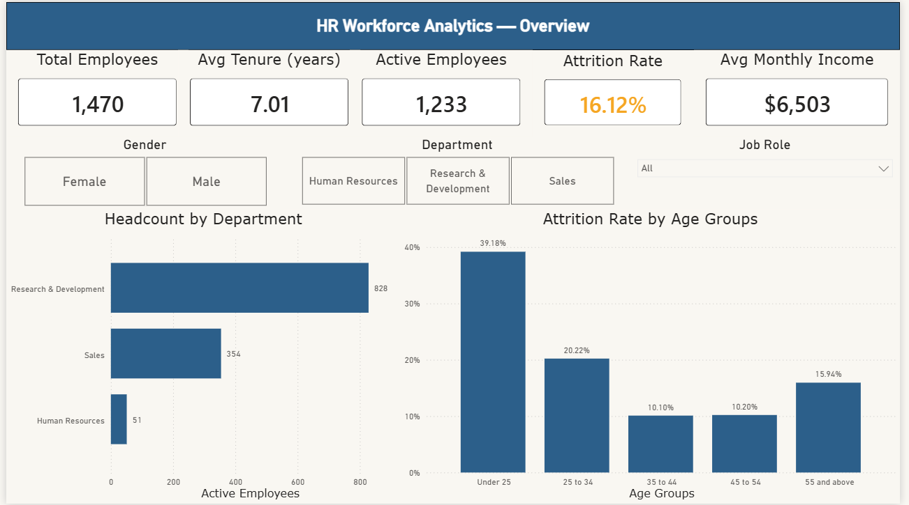

# HR Workforce Analytics Dashboard
### A Beginner-Friendly Power BI Project



---

## About This Project

This is a guided Power BI project designed for students who are building their first business intelligence dashboard. By the end of this project, you will have built a professional, interactive HR analytics report that analyzes employee attrition — one of the most common and valuable use cases in real HR departments.

**Business Question:** *What drives employee attrition, and where should HR intervene?*

**Dataset:** [IBM HR Analytics Employee Attrition Dataset](https://www.kaggle.com/datasets/pavansubhasht/ibm-hr-analytics-attrition-dataset) — publicly available on Kaggle, 1,470 employee records, 35 columns.

---

## What You Will Learn

By completing this project you will be able to:

- Load and clean data using **Power Query**
- Create calculated columns and custom groups
- Build **DAX measures** organized in a dedicated measures table
- Design a multi-page interactive dashboard
- Use **conditional formatting** to create live risk indicators
- Build **tooltip pages** for contextual drill-down
- Apply professional theming and layout principles

---

## Tools Required

- Microsoft Power BI Desktop (free) — [Download here](https://powerbi.microsoft.com/desktop/)
- Kaggle account (free) — to download the dataset

---

## Project Structure

```
HR-Workforce-Analytics/
├── HR_data.pbix              ← Power BI report file
├── README.md                 ← This file
└── screenshots/
    ├── overview.png
    ├── attrition-analysis.png
    ├── retention-risk.png
    ├── tooltip-department.png
    └── tooltip-age.png
```

---

## Dashboard Pages

### Page 1 — Overview


A high-level snapshot of the workforce. Includes 5 KPI cards, headcount by department, and attrition rate by age group. Slicers allow filtering by Gender, Department, and Job Role.

**Key KPIs:**
- Total Employees: 1,470
- Active Employees: 1,233
- Attrition Rate: 16.12%
- Avg Tenure: 7.01 years
- Avg Monthly Income: $6,503

---

### Page 2 — Attrition Analysis


A deep dive into attrition drivers across multiple dimensions. This page answers the question: *who is leaving and why?*

**Key Findings:**
- Sales Representatives have the highest attrition at **39.76%**
- Single employees leave at more than double the rate of divorced employees (25.53% vs 10.09%)
- Male employees leave at a slightly higher rate than female (17.01% vs 14.80%)
- Sales department has the highest overall attrition (20.63%)

---

### Page 3 — Retention Risk


Focuses on actionable retention insights. Includes a written recommendations panel summarizing key findings and suggested HR interventions.

**Key Findings:**
- Employees with no stock options leave at nearly **3x the rate** of those with options
- Employees earning under $3K monthly leave at **29%**
- 36% of employees leave within their **first year**
- **97 current employees** are high risk (low satisfaction + overtime)

---

## Advanced Features

### Tooltip Pages
Hover over any department or age group bar to see a contextual breakdown popup.

**Department Tooltip** — shows attrition rate by job role within the selected department:


**Age Group Tooltip** — shows average monthly income for the selected age group:


### Conditional Formatting
The Attrition Rate KPI card changes color based on the current value:
- 🟢 Green — below 15% (healthy)
- 🟠 Orange — 15% to 20% (warning)
- 🔴 Red — above 20% (critical)

Filter to the Sales department to see the card turn red at 20.63%.

---

## Step-by-Step Guide for Students

### Step 1 — Download the Dataset
1. Go to [Kaggle IBM HR Dataset](https://www.kaggle.com/datasets/pavansubhasht/ibm-hr-analytics-attrition-dataset)
2. Create a free Kaggle account if you don't have one
3. Download and extract the CSV file

---

### Step 2 — Load and Clean Data in Power Query
1. Open Power BI Desktop
2. Home → Get Data → Text/CSV → select the file
3. Click **Transform Data** (not Load)
4. In Power Query, remove these 3 useless columns — they have the same value for every row:
   - `EmployeeCount` (always = 1)
   - `Over18` (always = Y)
   - `StandardHours` (always = 80)
5. Rename the table to `HR_Data`
6. Add a custom column called `AttritionFlag`:
   - Add Column → Conditional Column
   - If `Attrition` = "Yes" then 1, else 0
7. Add a custom column called `Age Group`:
```
if [Age] < 25 then "Under 25"
else if [Age] <= 34 then "25 to 34"
else if [Age] <= 44 then "35 to 44"
else if [Age] <= 54 then "45 to 54"
else "55 and above"
```
8. Add a sort column called `Age Group Sort`:
```
if [Age] < 25 then 1
else if [Age] <= 34 then 2
else if [Age] <= 44 then 3
else if [Age] <= 54 then 4
else 5
```
9. Add a custom column called `Income Band`:
```
if [MonthlyIncome] < 3000 then "Under 3K"
else if [MonthlyIncome] < 6000 then "3K to 6K"
else if [MonthlyIncome] < 9000 then "6K to 9K"
else if [MonthlyIncome] < 12000 then "9K to 12K"
else "Above 12K"
```
10. Add a sort column called `Income Band Sort`:
```
if [MonthlyIncome] < 3000 then 1
else if [MonthlyIncome] < 6000 then 2
else if [MonthlyIncome] < 9000 then 3
else if [MonthlyIncome] < 12000 then 4
else 5
```
11. Click **Close & Apply**

> **Why sort columns?** Power BI sorts text alphabetically by default. Without sort columns, "Under 25" would appear last instead of first. The numeric sort column tells Power BI the correct order.

---

### Step 3 — Set Sort by Column
In Data view, set the sort order for your custom columns:
1. Click `Age Group` column → Column Tools → Sort by Column → `Age Group Sort`
2. Click `Income Band` column → Column Tools → Sort by Column → `Income Band Sort`

---

### Step 4 — Create a Measures Table
Instead of storing measures inside `HR_Data`, create a dedicated table to keep everything organized:

1. Home → Enter Data
2. Rename the column to `Measures`
3. Rename the table to `_Measures` (underscore makes it sort to the top)
4. Click Load
5. Delete the dummy row in Data view

> **Why a separate measures table?** As your report grows, having all DAX measures in one place makes them easy to find and maintain. This is standard practice in professional BI development.

---

### Step 5 — Create DAX Measures
Always click on the `_Measures` table first before creating a new measure.

**Foundation Measures:**
```dax
Total Employees = COUNTROWS(HR_Data)

Total Attrition = SUM(HR_Data[AttritionFlag])

Attrition Rate = DIVIDE([Total Attrition], [Total Employees], 0)

Active Employees = [Total Employees] - [Total Attrition]

Avg Monthly Income = AVERAGE(HR_Data[MonthlyIncome])

Avg Age = AVERAGE(HR_Data[Age])

Avg Tenure = AVERAGE(HR_Data[YearsAtCompany])
```

**Advanced Measures:**
```dax
Attrition Rate OT = 
CALCULATE([Attrition Rate], HR_Data[OverTime] = "Yes")

Attrition Rate No OT = 
CALCULATE([Attrition Rate], HR_Data[OverTime] = "No")

Avg Satisfaction = 
AVERAGEX(
    HR_Data,
    (HR_Data[JobSatisfaction] + 
     HR_Data[EnvironmentSatisfaction] + 
     HR_Data[RelationshipSatisfaction]) / 3
)

High Risk Lost = 
CALCULATE(
    [Total Attrition],
    HR_Data[JobSatisfaction] <= 2,
    HR_Data[OverTime] = "Yes"
)

High Risk Remaining = 
CALCULATE(
    [Active Employees],
    HR_Data[JobSatisfaction] <= 2,
    HR_Data[OverTime] = "Yes"
)

Retention Rate = 1 - [Attrition Rate]

Attrition Rate Label = 
FORMAT([Attrition Rate], "0.0%") & " attrition rate"
```

> **Understanding CALCULATE:** This is the most important DAX function. It takes any measure and re-evaluates it under a filter condition. `Attrition Rate OT` asks: *"what is the attrition rate, but only for overtime employees?"* — a powerful way to compare segments without needing extra visuals.

---

### Step 6 — Apply a Theme
View tab → Themes → **Frontier**

This gives your report a clean, professional look immediately.

---

### Step 7 — Build Page 1 (Overview)
**Header:** Insert → Text Box → type your title → set background to `#2C5F8A`

**KPI Cards:** Add 5 card visuals with these measures:
- Total Employees
- Avg Tenure
- Active Employees
- Attrition Rate (apply conditional formatting — see Step 9)
- Avg Monthly Income

**Charts:**
- Clustered Bar Chart: Department (Y-axis) vs Active Employees (X-axis)
- Clustered Column Chart: Age Group (X-axis) vs Attrition Rate (Y-axis)

**Slicers:** Add tile slicers for Gender and Department, dropdown slicer for Job Role

---

### Step 8 — Build Page 2 (Attrition Analysis)
Copy the header from Page 1 and update the title text.

**Add these visuals:**
- Attrition Rate card + High Risk Lost card + High Risk Remaining card
- Clustered Bar Chart: Attrition Rate by Marital Status
- Clustered Bar Chart: Attrition Rate by Department
- Clustered Bar Chart: Attrition Rate by Job Role
- Clustered Bar Chart: Attrition Rate by Gender
- Slicers: Gender, Department, OverTime

---

### Step 9 — Build Page 3 (Retention Risk)
Copy the header from Page 2 and update the title text.

**Add these visuals:**
- Clustered Column Chart: Attrition Rate by Stock Option Level
- Clustered Column Chart: Attrition Rate by Job Satisfaction
- Line/Column Chart: Attrition Rate by Years at Company (filter to ≤ 20 years)
- Clustered Column Chart: Attrition Rate by Income Band
- Text Box: Key Findings & Recommendations

---

### Step 10 — Conditional Formatting on Attrition Rate Card
1. Click the Attrition Rate card
2. Format pane → Callout value → Color → click **fx**
3. Format style → **Rules**
4. Set rules using whole numbers (Power BI reads percentages as 0-100):
   - If value >= 20 and <= Max → Red
   - If value >= 15 and < 20 → Orange
   - If value >= Min and < 15 → Green

---

### Step 11 — Create Tooltip Pages
Tooltips show a mini chart when users hover over a visual.

**Tooltip 1 — Department breakdown:**
1. Add new page → rename to `Tooltip - Department`
2. Format pane → Canvas settings → Type → **Tooltip**
3. Format pane → Page information → Allow use as tooltip → **On**
4. Add a bar chart: Job Role (Y-axis) vs Attrition Rate (X-axis)
5. Go to your Department charts → Format pane → General → Tooltips → Type → Report page → select `Tooltip - Department`

**Tooltip 2 — Age group income:**
1. Add new page → rename to `Tooltip - Age`
2. Repeat tooltip setup steps
3. Add a column chart: Age Group (X-axis) vs Avg Monthly Income (Y-axis)
4. Assign to your Age Group chart

---

## Key Insights Summary

| Finding | Value | Implication |
|---------|-------|-------------|
| Overall attrition rate | 16.12% | Industry benchmark is ~10-15% — slightly above average |
| Highest risk job role | Sales Representative | 39.76% attrition — needs immediate review |
| Overtime impact | 30.5% vs 10.4% | Overtime nearly triples attrition risk |
| Stock option impact | Level 0 vs Level 1 | No options = ~3x higher attrition |
| Early tenure risk | Year 0-2 | 36%+ attrition in first 2 years |
| High risk employees remaining | 97 | Immediate intervention opportunity |

---

## Skills Demonstrated

| Skill | Details |
|-------|---------|
| Power Query | Data cleaning, custom columns, sort columns |
| DAX | 13 measures including CALCULATE, AVERAGEX, DIVIDE, FORMAT |
| Data modeling | Dedicated measures table, proper column typing |
| Visualization | 3-page report, 15+ visuals, slicers, KPI cards |
| Advanced features | Tooltip pages, conditional formatting |
| Analytical thinking | Custom groupings, small sample filtering, insight narrative |

---

## About the Author

**Alireza Samea**
- UBC Sauder Business Intelligence with Power BI Certificate
- Professor and Data Analytics Instructor
- GitHub: [alirezasamea](https://github.com/alirezasamea)
- Email: alireza.samea@queensu.ca

---

*Dataset: IBM HR Analytics Employee Attrition — fictional dataset created by IBM data scientists, publicly available on Kaggle.*
