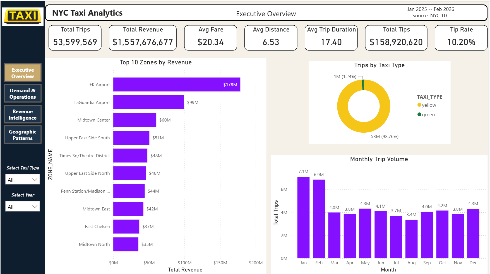
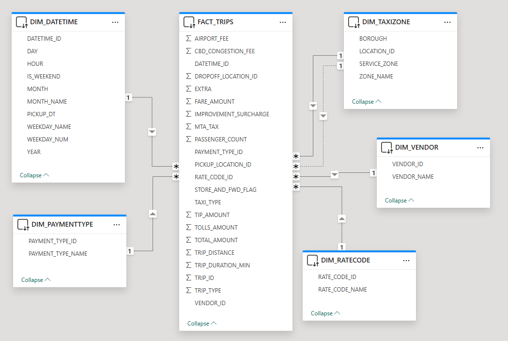
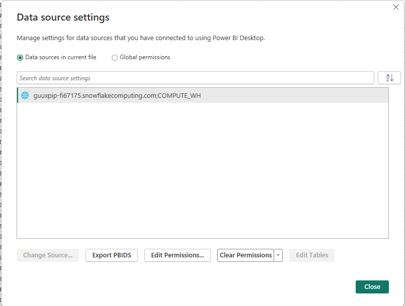
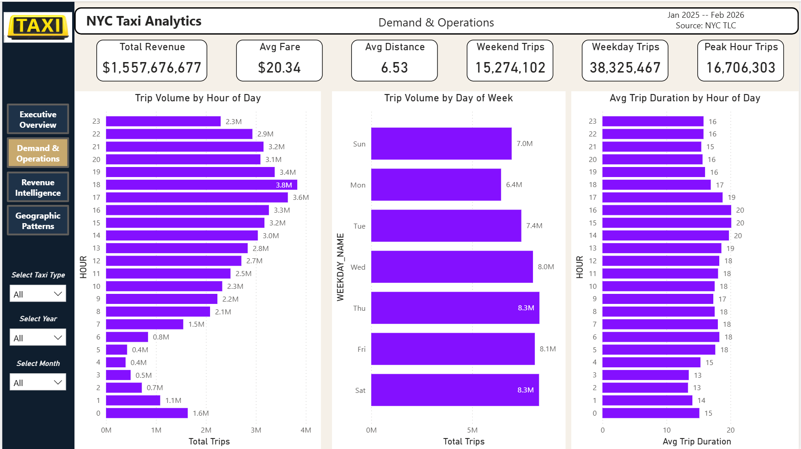
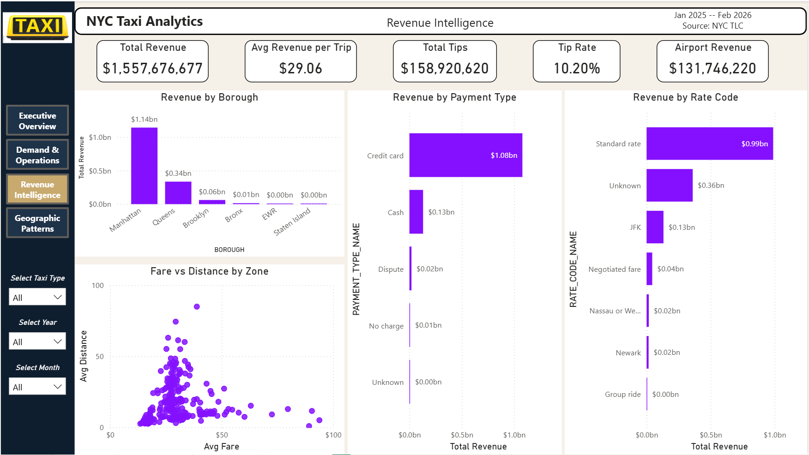
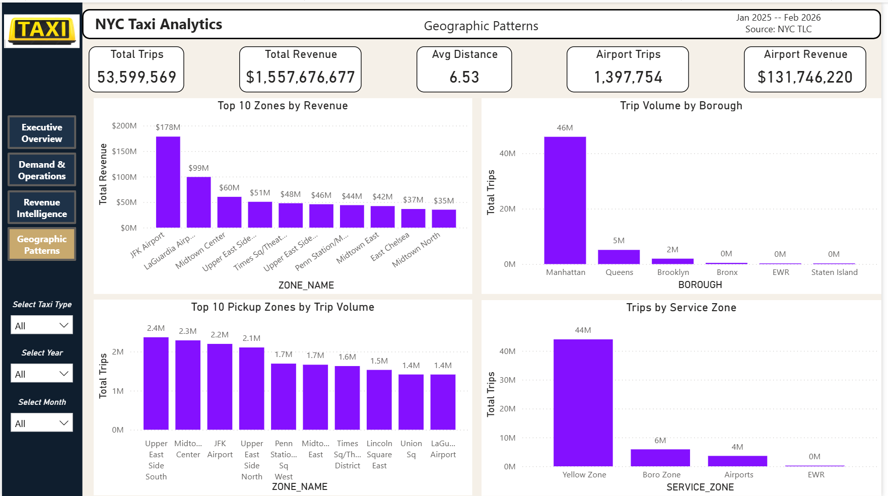

# NYC Taxi Analytics - Power BI on Snowflake
### Phase 3: Business Intelligence Layer



--

## About This Project

This is Phase 3 of the NYC Taxi Analytics project. In Phase 1 we designed a star schema in MySQL and built a Python ETL pipeline that loaded 53.6 million real taxi trips. In Phase 2 we migrated the same schema to Snowflake and demonstrated that queries taking hours in MySQL run in under 3 seconds in a columnar data warehouse.

In this phase we connect Power BI directly to the Snowflake warehouse using DirectQuery and build a four-page decision-maker dashboard on top of the live data.

The result is a complete modern analytics stack:

```
NYC TLC Raw Data → Python ETL → Snowflake Star Schema → Power BI DirectQuery Dashboard
```

**Data Source:** [NYC TLC Trip Record Data](https://www.nyc.gov/site/tlc/about/tlc-trip-record-data.page), publicly available from the NYC Taxi and Limousine Commission.
**Coverage:** Yellow and Green taxi trips, January 2025 to February 2026, 53.6 million trips.
**Database:** Snowflake star schema (NYC_TAXI.MAIN), 5 dimension tables + 1 fact table.

**Phase 1:** [NYC Taxi SQL Analytics - MySQL](https://github.com/alirezasamea/data-analytics-portfolio/tree/main/SQL/NYC-Taxi-SQL-Analytics)
**Phase 2:** [NYC Taxi Analytics - Snowflake](https://github.com/alirezasamea/data-analytics-portfolio/tree/main/SQL/NYC-Taxi-Snowflake)

**Live Dashboard:** [View on Power BI](https://app.powerbi.com/links/sy3GHn2AaW?ctid=a8eec281-aaa3-4dae-ac9b-9a398b9215e7&pbi_source=linkShare) *(requires a free Power BI account to view)*

--

## What You Will Learn

After finishing this project you will be able to:

- Connect Power BI Desktop to Snowflake using DirectQuery
- Understand the difference between DirectQuery and Import mode and when to use each
- Build relationships in Power BI from a star schema with inactive relationships
- Write DAX measures that filter across dimension and fact tables
- Use USERELATIONSHIP() to activate an inactive relationship in a specific measure
- Design a multi-page dashboard with left panel navigation
- Apply consistent layout and theming across all pages
- Understand what DAX patterns are not supported in DirectQuery mode and why

--

## Why DirectQuery and Not Import?

This is the most important architectural decision in this project, and it is worth explaining clearly.

**Import mode** pulls a copy of all data into Power BIs in-memory engine (VertiPaq). Visuals respond instantly because everything is local. The tradeoff is that the data is a snapshot - it goes stale between refreshes, and importing 53.6 million rows requires significant memory and refresh time.

**DirectQuery** sends a live SQL query to Snowflake every time a visual renders or a slicer is clicked. The data is always current. The tradeoff is that response time depends on the warehouse.

For this project DirectQuery is the correct choice for two reasons. First, the whole point of Phase 2 was to show that Snowflake handles analytical queries on 53 million rows in under 3 seconds. DirectQuery lets Power BI take advantage of that speed rather than bypassing it with a local copy. Second, in a production taxi analytics system, data would arrive continuously - DirectQuery keeps the dashboard live without scheduled refreshes.

> **Practical note for portfolio use:** Snowflake free trial credits eventually expire. Before your trial ends, you can switch the Power BI file from DirectQuery to Import, do a full refresh, and save. The report will then work without a Snowflake connection. The README documents DirectQuery as the correct architectural choice - the Import switch is just a practical workaround for a portfolio artifact.

--

## Architecture and Data Cleaning

In a traditional Power BI project, significant time is spent in Power Query cleaning raw data. In this architecture that responsibility belongs upstream. The Python ETL pipeline in Phase 1 handled data quality checks, the Snowflake loading scripts in Phase 2 applied minimum filters, and by the time Power BI connects the data is already clean and structured.

This is the correct separation of concerns in a modern data stack: ETL handles data quality, the warehouse handles storage and performance, and the BI layer handles presentation and analysis only. There is no Power Query transformation in this project.

--

## Tools Required

- Microsoft Power BI Desktop (free), [Download here](https://powerbi.microsoft.com/desktop/)
- Snowflake account with the NYC_TAXI database from Phase 2 loaded
- Completed Phase 1 and Phase 2 of this project

--

## Project Structure

```
NYC-Taxi-PowerBI/
├── NYC_Taxi_Analytics.pbix
├── README.md
└── Screenshots/
    ├── Executive-Overview.png
    ├── Demand-Operations.png
    ├── Revenue-Intelligence.png
    ├── Geographic-Patterns.png
    ├── Data-Model.png
    └── Snowflake-Connection.png
```

--

## Data Model



The Power BI data model mirrors the Snowflake star schema exactly. FACT_TRIPS sits at the center with five dimension tables connected via many-to-one relationships. Filters flow from dimension tables into the fact table, which is what makes DAX measures like `Weekend Trips` work - a filter on DIM_DATETIME travels along the relationship into FACT_TRIPS automatically.

**Active relationships:**
- FACT_TRIPS[DATETIME_ID] → DIM_DATETIME[DATETIME_ID]
- FACT_TRIPS[VENDOR_ID] → DIM_VENDOR[VENDOR_ID]
- FACT_TRIPS[RATE_CODE_ID] → DIM_RATECODE[RATE_CODE_ID]
- FACT_TRIPS[PAYMENT_TYPE_ID] → DIM_PAYMENTTYPE[PAYMENT_TYPE_ID]
- FACT_TRIPS[PICKUP_LOCATION_ID] → DIM_TAXIZONE[LOCATION_ID]

**Inactive relationship:**
- FACT_TRIPS[DROPOFF_LOCATION_ID] → DIM_TAXIZONE[LOCATION_ID]

Power BI only allows one active relationship between two tables. The dropoff relationship is defined as inactive and can be activated in specific DAX measures using USERELATIONSHIP() when dropoff zone analysis is needed.

> **Why do zone visuals show pickup zones?** Because the active relationship uses PICKUP_LOCATION_ID. Any visual using ZONE_NAME from DIM_TAXIZONE automatically reflects pickup locations. This is why the title "Top 10 Pickup Zones" is accurate without any additional filtering.

--

## Snowflake Connection Setup



1. Open Power BI Desktop
2. Home tab → Get Data → Snowflake
3. Fill in the connection fields:
   - **Server:** `your-account-identifier.snowflakecomputing.com`
   - **Warehouse:** `COMPUTE_WH`
   - **Database:** `NYC_TAXI`
4. Click OK
5. Enter your Snowflake credentials (Basic authentication)
6. In the Navigator, expand NYC_TAXI → MAIN and select all 6 tables
7. Click Load
8. When prompted for Data Connectivity mode, select **DirectQuery**

After loading, go to Model view and create the 5 relationships listed above manually. Snowflake does not enforce foreign keys, so Power BI cannot auto-detect them.

--

## DAX Measures

Create a dedicated measures table first: Home tab → Enter Data → rename the table to `_Measures`. Store all measures here to keep the model organized.

### Foundation Measures

```dax
Total Trips = COUNTROWS(FACT_TRIPS)

Total Revenue = SUM(FACT_TRIPS[TOTAL_AMOUNT])

Total Fare = SUM(FACT_TRIPS[FARE_AMOUNT])

Total Tips = SUM(FACT_TRIPS[TIP_AMOUNT])

Avg Fare = AVERAGE(FACT_TRIPS[FARE_AMOUNT])

Avg Distance = AVERAGE(FACT_TRIPS[TRIP_DISTANCE])

Avg Trip Duration = AVERAGE(FACT_TRIPS[TRIP_DURATION_MIN])

Avg Passengers = AVERAGE(FACT_TRIPS[PASSENGER_COUNT])

Avg Revenue per Trip = DIVIDE([Total Revenue], [Total Trips], 0)

Avg Tip per Trip = DIVIDE([Total Tips], [Total Trips], 0)

Tip Rate = DIVIDE([Total Tips], [Total Revenue], 0)
```

### Taxi Type Measures

```dax
Yellow Trip Count = CALCULATE([Total Trips], FACT_TRIPS[TAXI_TYPE] = "yellow")

Green Trip Count = CALCULATE([Total Trips], FACT_TRIPS[TAXI_TYPE] = "green")

Yellow Trip % = DIVIDE([Yellow Trip Count], [Total Trips], 0)

Green Trip % = DIVIDE([Green Trip Count], [Total Trips], 0)
```

> **Important:** TAXI_TYPE values in Snowflake are lowercase ("yellow", "green"). Your CALCULATE filter must match exactly. Always verify column values before writing filters - in DirectQuery you cannot browse data interactively, so add a Table visual with the column to check values before relying on them in DAX.

### Demand Measures

```dax
Weekend Trips = CALCULATE([Total Trips], DIM_DATETIME[WEEKDAY_NUM] IN {0, 6})

Weekday Trips = CALCULATE([Total Trips], DIM_DATETIME[WEEKDAY_NUM] IN {1, 2, 3, 4, 5})

Peak Hour Trips = CALCULATE(
    [Total Trips],
    DIM_DATETIME[HOUR] >= 7 && DIM_DATETIME[HOUR] <= 9
    || DIM_DATETIME[HOUR] >= 17 && DIM_DATETIME[HOUR] <= 19
)
```

> **WEEKDAY_NUM encoding:** Snowflake's DAYOFWEEK function returns 0 for Sunday through 6 for Saturday. This is why weekend uses {0, 6} not {1, 7}.

> **IS_WEEKEND column limitation:** The IS_WEEKEND column in DIM_DATETIME was populated during the Snowflake ETL but all values were set to FALSE due to a pipeline issue. The WEEKDAY_NUM approach above correctly identifies weekend trips regardless of this column.

### Revenue Measures

```dax
Airport Trips = CALCULATE([Total Trips], FACT_TRIPS[RATE_CODE_ID] = 2)

Airport Revenue = CALCULATE([Total Revenue], FACT_TRIPS[RATE_CODE_ID] = 2)
```

--

## DirectQuery Limitations Encountered

DirectQuery imposes real constraints on DAX that are worth documenting for anyone building on this project.

**Avg Daily Trips could not be built reliably.** The goal was to divide Total Trips by the number of distinct service days. The PICKUP_DT column in DIM_DATETIME stores full timestamps (not dates), so DISTINCTCOUNT returns ~25 million distinct values rather than distinct days. The SELECTCOLUMNS approach to truncate timestamps triggered a 1 million row limit error because DirectQuery attempted to pull the full column locally for processing. A proper solution would require adding a DATE_ONLY column to DIM_DATETIME in Snowflake itself - a design improvement worth noting for production.

**Row-level iteration functions are restricted.** AVERAGEX, SUMX, and similar iterator functions that need to evaluate row by row against large tables can exceed the DirectQuery row limit. Keep measures as simple aggregations where possible.

**Calculated columns on Snowflake tables are not supported.** All column derivations must happen in Snowflake before Power BI connects. This reinforces the architecture principle: transformation belongs in the warehouse, not the BI layer.

--

## Dashboard Pages

### Page 1 - Executive Overview


The entry point for any stakeholder. Seven KPI cards give an immediate picture of the full dataset, followed by the top revenue zones, taxi type split, and monthly volume trend.

**Key numbers:**
- Total Trips: 53,599,569
- Total Revenue: $1,557,676,677
- Avg Fare: $20.34
- Avg Distance: 6.53 miles
- Avg Trip Duration: 17.40 minutes
- Total Tips: $158,920,620
- Tip Rate: 10.20%

**Slicers:** Taxi Type, Year

--

### Page 2 - Demand and Operations


Answers the operational question: when is demand highest and how does it distribute across time?

**Key numbers:**
- Weekend Trips: 15,274,102 (28.5% of total)
- Weekday Trips: 38,325,467 (71.5% of total)
- Peak Hour Trips: 16,706,303

**What the data shows:**
- Peak volume hour is 6pm (3.8M trips) - evening commute drives the highest demand
- Afternoon hours (2pm to 4pm) have the longest average trip duration (20 minutes) due to traffic congestion
- Thursday, Friday, and Saturday are the busiest days
- Monday is consistently the quietest day with 6.4M trips vs 8.3M on Thursday

**Slicers:** Taxi Type, Year, Month

--

### Page 3 - Revenue Intelligence


Answers the revenue question: where does money come from and how is it distributed?

**Key numbers:**
- Avg Revenue per Trip: $29.06 (higher than Avg Fare $20.34 because it includes surcharges, congestion fees, and tips)
- Airport Revenue: $131,746,220
- Credit card payments: $1.08bn (69% of total revenue)

**What the data shows:**
- Manhattan generates $1.14bn in revenue, more than triple all other boroughs combined
- Credit card is the dominant payment method at nearly 3x cash revenue
- Standard rate trips generate $0.99bn while JFK airport rate generates $0.13bn - despite JFK being the top revenue zone by pickup location, most of that revenue comes from standard-rated trips
- The Fare vs Distance scatter shows that most zones cluster tightly in the short trip range, with airport-area zones as clear outliers

**Slicers:** Taxi Type, Year, Month

--

### Page 4 - Geographic Patterns


Answers the geographic question: where do trips originate and how is volume distributed across the city?

**Key numbers:**
- Airport Trips: 1,397,754
- Airport Revenue: $131,746,220

**What the data shows:**
- Manhattan accounts for 46M of 53.6M total trips - 86% of all taxi activity
- Yellow Zone (Manhattan service area) generates 44M trips vs 6M for Boro Zone
- JFK Airport is 3rd in pickup volume (2.2M trips) but 1st in total revenue ($178M) - airport runs generate nearly $80 revenue per trip vs $20 for typical Manhattan rides
- Upper East Side South is the busiest pickup zone by trip count at 2.4M trips, but ranks 4th in revenue
- The volume vs revenue gap between zones is the key insight: high trip count does not mean high revenue

**Slicers:** Taxi Type, Year, Month

--

## Key Insights Summary

| Finding | Value | Implication |
|-----|----|-------|
| Total revenue | $1.56B over 14 months | Large, active market |
| Yellow vs Green split | 98.76% vs 1.24% of trips | Green taxi market is negligible by volume |
| Peak demand hour | 6pm (3.8M trips) | Evening commute drives fleet utilization |
| Busiest day | Thursday and Saturday (8.3M each) | Mid-week and weekend peaks require different staffing |
| Top revenue zone | JFK Airport ($178M) | Airport runs generate 4x more revenue per trip than typical rides |
| Top volume zone | Upper East Side South (2.4M trips) | High volume but lower revenue per trip |
| Payment method | Credit card 69% of revenue | NYC taxis are overwhelmingly cashless |
| Tip rate | 10.20% of total revenue | Tips are a significant revenue component |
| Manhattan dominance | 86% of all trips | Outer borough taxi market is largely underserved |

--

## About the Author

**Alireza Samea**
- Assistant Professor, University Canada West
- Lecturer, Northeastern University Vancouver
- GitHub: [alirezasamea](https://github.com/alirezasamea)
- LinkedIn: [alirezasamea](https://www.linkedin.com/in/alirezasamea/)

--

*Data source: NYC Taxi and Limousine Commission (TLC) Trip Record Data, publicly available at nyc.gov. Data covers January 2025 to February 2026.*
