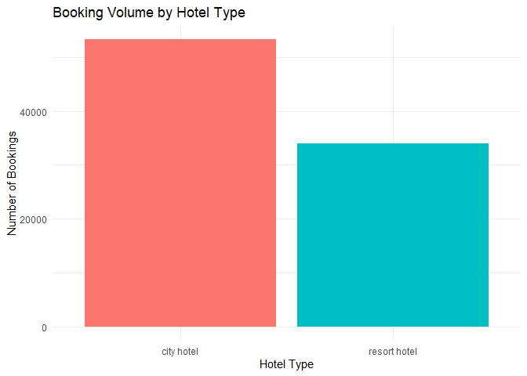
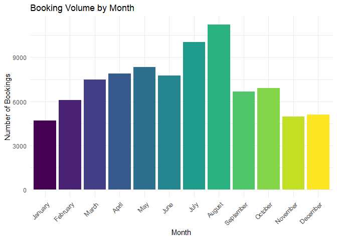
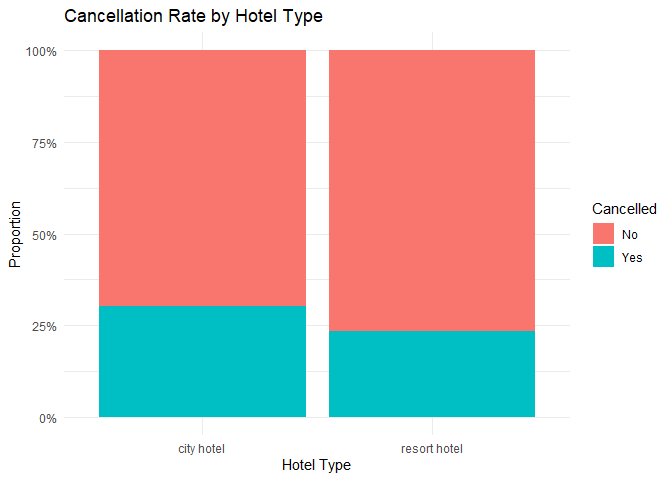
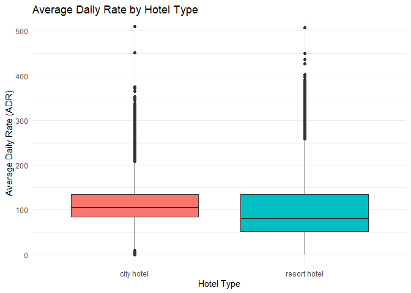
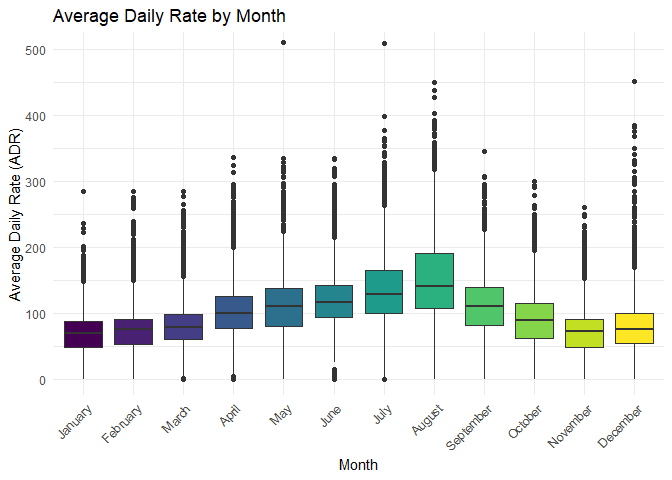
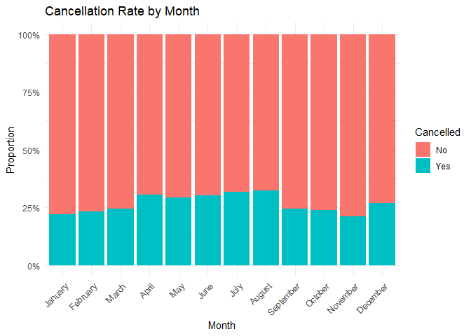
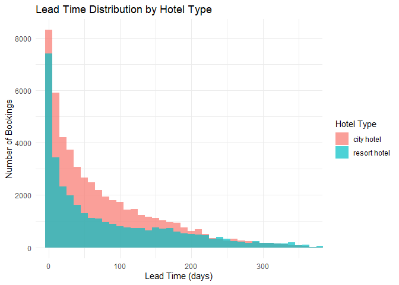
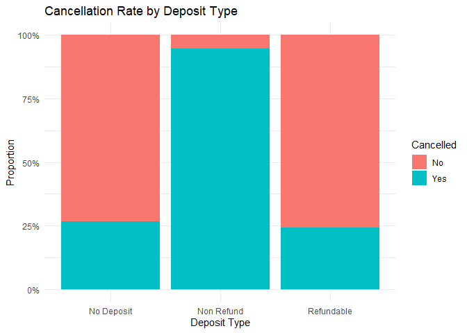
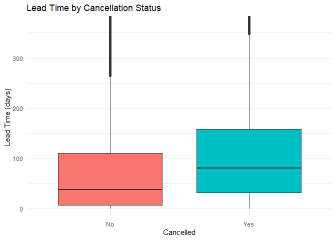

Hotel Booking Demand Analysis
================
Alireza Samea
2026-04-04

## Project Overview

This analysis explores the [Hotel Booking Demand
dataset](https://www.kaggle.com/datasets/jessemostipak/hotel-booking-demand),
a publicly available dataset on Kaggle containing 119,390 hotel booking
records across two hotel types: city hotels and resort hotels. The data
includes information on booking patterns, guest demographics, pricing,
and cancellations.

The central business question we are trying to answer is: **What factors
influence hotel booking cancellations, pricing, and guest behavior and
what can hotel managers do about it?**

**Dataset:** Jesse Mostipak via Kaggle \| 119,390 rows \| 32 columns

## Analysis Plan

1.  **Data Loading and Exploration** - import libraries, load data,
    inspect structure
2.  **Data Cleaning and Preparation** - handle missing values, fix data
    types, create new variables
3.  **Exploratory Data Analysis (EDA)** - booking patterns, seasonal
    trends, hotel type comparisons
4.  **Hypothesis Testing** - inferential statistics to test key business
    assumptions
5.  **Cancellation Analysis** - what predicts whether a booking gets
    cancelled
6.  **Key Insights and Recommendations** - summary of findings for hotel
    management

## Section 1: Data Loading and Exploration

### 1.1 Load Libraries

We will use the following packages:

- **tidyverse**: a collection of R packages for data science, including
  `ggplot2` for visualization, `dplyr` for data manipulation, and
  `readr` for importing data
- **knitr**: formats tables and output neatly in the HTML document

``` r
library(tidyverse)
library(knitr)
```

### 1.2 Load the Dataset

We load the CSV file into a data frame called `hotel_data`. A data frame
is R’s version of a table where rows are observations (individual
bookings) and columns are variables (features of each booking).

``` r
hotel_data <- read.csv("Dataset/hotel_bookings.csv")
dim(hotel_data)
```

    ## [1] 119390     32

``` r
head(hotel_data)
```

    ##          hotel is_canceled lead_time arrival_date_year arrival_date_month
    ## 1 Resort Hotel           0       342              2015               July
    ## 2 Resort Hotel           0       737              2015               July
    ## 3 Resort Hotel           0         7              2015               July
    ## 4 Resort Hotel           0        13              2015               July
    ## 5 Resort Hotel           0        14              2015               July
    ## 6 Resort Hotel           0        14              2015               July
    ##   arrival_date_week_number arrival_date_day_of_month stays_in_weekend_nights
    ## 1                       27                         1                       0
    ## 2                       27                         1                       0
    ## 3                       27                         1                       0
    ## 4                       27                         1                       0
    ## 5                       27                         1                       0
    ## 6                       27                         1                       0
    ##   stays_in_week_nights adults children babies meal country market_segment
    ## 1                    0      2        0      0   BB     PRT         Direct
    ## 2                    0      2        0      0   BB     PRT         Direct
    ## 3                    1      1        0      0   BB     GBR         Direct
    ## 4                    1      1        0      0   BB     GBR      Corporate
    ## 5                    2      2        0      0   BB     GBR      Online TA
    ## 6                    2      2        0      0   BB     GBR      Online TA
    ##   distribution_channel is_repeated_guest previous_cancellations
    ## 1               Direct                 0                      0
    ## 2               Direct                 0                      0
    ## 3               Direct                 0                      0
    ## 4            Corporate                 0                      0
    ## 5                TA/TO                 0                      0
    ## 6                TA/TO                 0                      0
    ##   previous_bookings_not_canceled reserved_room_type assigned_room_type
    ## 1                              0                  C                  C
    ## 2                              0                  C                  C
    ## 3                              0                  A                  C
    ## 4                              0                  A                  A
    ## 5                              0                  A                  A
    ## 6                              0                  A                  A
    ##   booking_changes deposit_type agent company days_in_waiting_list customer_type
    ## 1               3   No Deposit  NULL    NULL                    0     Transient
    ## 2               4   No Deposit  NULL    NULL                    0     Transient
    ## 3               0   No Deposit  NULL    NULL                    0     Transient
    ## 4               0   No Deposit   304    NULL                    0     Transient
    ## 5               0   No Deposit   240    NULL                    0     Transient
    ## 6               0   No Deposit   240    NULL                    0     Transient
    ##   adr required_car_parking_spaces total_of_special_requests reservation_status
    ## 1   0                           0                         0          Check-Out
    ## 2   0                           0                         0          Check-Out
    ## 3  75                           0                         0          Check-Out
    ## 4  75                           0                         0          Check-Out
    ## 5  98                           0                         1          Check-Out
    ## 6  98                           0                         1          Check-Out
    ##   reservation_status_date
    ## 1              2015-07-01
    ## 2              2015-07-01
    ## 3              2015-07-02
    ## 4              2015-07-02
    ## 5              2015-07-03
    ## 6              2015-07-03

The dataset contains **119,390 rows** and **32 columns**, meaning we
have 119,390 individual hotel bookings with 32 pieces of information
recorded for each one. Note that we will reload the data in Section 2.2
with proper settings after inspecting its structure.

## Section 2: Data Cleaning and Preparation

Before we analyze the data, we need to inspect and clean it. Raw
datasets often contain missing values, incorrect data types, and
variables that need to be transformed before they are useful for
analysis.

### 2.1 Inspect the Data

We start by checking the column names and structure of the dataset. The
`colnames()` function shows us all 32 variable names, and `str()` shows
us the data type of each column along with a preview of its values.

``` r
colnames(hotel_data)
```

    ##  [1] "hotel"                          "is_canceled"                   
    ##  [3] "lead_time"                      "arrival_date_year"             
    ##  [5] "arrival_date_month"             "arrival_date_week_number"      
    ##  [7] "arrival_date_day_of_month"      "stays_in_weekend_nights"       
    ##  [9] "stays_in_week_nights"           "adults"                        
    ## [11] "children"                       "babies"                        
    ## [13] "meal"                           "country"                       
    ## [15] "market_segment"                 "distribution_channel"          
    ## [17] "is_repeated_guest"              "previous_cancellations"        
    ## [19] "previous_bookings_not_canceled" "reserved_room_type"            
    ## [21] "assigned_room_type"             "booking_changes"               
    ## [23] "deposit_type"                   "agent"                         
    ## [25] "company"                        "days_in_waiting_list"          
    ## [27] "customer_type"                  "adr"                           
    ## [29] "required_car_parking_spaces"    "total_of_special_requests"     
    ## [31] "reservation_status"             "reservation_status_date"

``` r
str(hotel_data)
```

    ## 'data.frame':    119390 obs. of  32 variables:
    ##  $ hotel                         : chr  "Resort Hotel" "Resort Hotel" "Resort Hotel" "Resort Hotel" ...
    ##  $ is_canceled                   : int  0 0 0 0 0 0 0 0 1 1 ...
    ##  $ lead_time                     : int  342 737 7 13 14 14 0 9 85 75 ...
    ##  $ arrival_date_year             : int  2015 2015 2015 2015 2015 2015 2015 2015 2015 2015 ...
    ##  $ arrival_date_month            : chr  "July" "July" "July" "July" ...
    ##  $ arrival_date_week_number      : int  27 27 27 27 27 27 27 27 27 27 ...
    ##  $ arrival_date_day_of_month     : int  1 1 1 1 1 1 1 1 1 1 ...
    ##  $ stays_in_weekend_nights       : int  0 0 0 0 0 0 0 0 0 0 ...
    ##  $ stays_in_week_nights          : int  0 0 1 1 2 2 2 2 3 3 ...
    ##  $ adults                        : int  2 2 1 1 2 2 2 2 2 2 ...
    ##  $ children                      : int  0 0 0 0 0 0 0 0 0 0 ...
    ##  $ babies                        : int  0 0 0 0 0 0 0 0 0 0 ...
    ##  $ meal                          : chr  "BB" "BB" "BB" "BB" ...
    ##  $ country                       : chr  "PRT" "PRT" "GBR" "GBR" ...
    ##  $ market_segment                : chr  "Direct" "Direct" "Direct" "Corporate" ...
    ##  $ distribution_channel          : chr  "Direct" "Direct" "Direct" "Corporate" ...
    ##  $ is_repeated_guest             : int  0 0 0 0 0 0 0 0 0 0 ...
    ##  $ previous_cancellations        : int  0 0 0 0 0 0 0 0 0 0 ...
    ##  $ previous_bookings_not_canceled: int  0 0 0 0 0 0 0 0 0 0 ...
    ##  $ reserved_room_type            : chr  "C" "C" "A" "A" ...
    ##  $ assigned_room_type            : chr  "C" "C" "C" "A" ...
    ##  $ booking_changes               : int  3 4 0 0 0 0 0 0 0 0 ...
    ##  $ deposit_type                  : chr  "No Deposit" "No Deposit" "No Deposit" "No Deposit" ...
    ##  $ agent                         : chr  "NULL" "NULL" "NULL" "304" ...
    ##  $ company                       : chr  "NULL" "NULL" "NULL" "NULL" ...
    ##  $ days_in_waiting_list          : int  0 0 0 0 0 0 0 0 0 0 ...
    ##  $ customer_type                 : chr  "Transient" "Transient" "Transient" "Transient" ...
    ##  $ adr                           : num  0 0 75 75 98 ...
    ##  $ required_car_parking_spaces   : int  0 0 0 0 0 0 0 0 0 0 ...
    ##  $ total_of_special_requests     : int  0 0 0 0 1 1 0 1 1 0 ...
    ##  $ reservation_status            : chr  "Check-Out" "Check-Out" "Check-Out" "Check-Out" ...
    ##  $ reservation_status_date       : chr  "2015-07-01" "2015-07-01" "2015-07-02" "2015-07-02" ...

The output shows us that some columns are stored as integers when they
should be treated as categories. For example, `is_canceled` is coded as
0 and 1 but represents a yes/no outcome, not a number. We will fix these
in the next step.

### 2.2 Check for Missing Values

We check how many missing values exist in each column using
`colSums(is.na())`. This helps us decide how to handle incomplete data
before analysis.

However, this dataset stores missing values as the string `"NULL"`
instead of leaving cells blank. We can confirm this by running
`class(hotel_data$agent)` which returns `"character"`, and
`head(hotel_data$agent)` which shows the literal text `"NULL"` in those
cells. This means R does not automatically recognize them as missing
values. We fix this by reloading the data with the `na.strings`
argument, which tells R to treat `"NULL"` as `NA`.

``` r
hotel_data <- read.csv("Dataset/hotel_bookings.csv", na.strings = c("", "NA", "NULL"))
colSums(is.na(hotel_data))
```

    ##                          hotel                    is_canceled 
    ##                              0                              0 
    ##                      lead_time              arrival_date_year 
    ##                              0                              0 
    ##             arrival_date_month       arrival_date_week_number 
    ##                              0                              0 
    ##      arrival_date_day_of_month        stays_in_weekend_nights 
    ##                              0                              0 
    ##           stays_in_week_nights                         adults 
    ##                              0                              0 
    ##                       children                         babies 
    ##                              4                              0 
    ##                           meal                        country 
    ##                              0                            488 
    ##                 market_segment           distribution_channel 
    ##                              0                              0 
    ##              is_repeated_guest         previous_cancellations 
    ##                              0                              0 
    ## previous_bookings_not_canceled             reserved_room_type 
    ##                              0                              0 
    ##             assigned_room_type                booking_changes 
    ##                              0                              0 
    ##                   deposit_type                          agent 
    ##                              0                          16340 
    ##                        company           days_in_waiting_list 
    ##                         112593                              0 
    ##                  customer_type                            adr 
    ##                              0                              0 
    ##    required_car_parking_spaces      total_of_special_requests 
    ##                              0                              0 
    ##             reservation_status        reservation_status_date 
    ##                              0                              0

Four columns contain missing values. The `agent` and `company` columns
have the most, with 16,340 and 112,593 missing values respectively. This
makes business sense because not every booking is made through a travel
agent or a corporate account. We will handle these in the next step.

### 2.3 Handle Missing Values

We handle each column differently based on what the missing value
actually means in context. For `children`, `agent`, and `company`, a
missing value means zero - no children, no agent, and no corporate
account. For `country`, we leave the 488 missing values as is since we
cannot make a safe assumption about where a guest is from.

``` r
hotel_data$children[is.na(hotel_data$children)] <- 0
hotel_data$agent[is.na(hotel_data$agent)]       <- 0
hotel_data$company[is.na(hotel_data$company)]   <- 0

colSums(is.na(hotel_data))
```

    ##                          hotel                    is_canceled 
    ##                              0                              0 
    ##                      lead_time              arrival_date_year 
    ##                              0                              0 
    ##             arrival_date_month       arrival_date_week_number 
    ##                              0                              0 
    ##      arrival_date_day_of_month        stays_in_weekend_nights 
    ##                              0                              0 
    ##           stays_in_week_nights                         adults 
    ##                              0                              0 
    ##                       children                         babies 
    ##                              0                              0 
    ##                           meal                        country 
    ##                              0                            488 
    ##                 market_segment           distribution_channel 
    ##                              0                              0 
    ##              is_repeated_guest         previous_cancellations 
    ##                              0                              0 
    ## previous_bookings_not_canceled             reserved_room_type 
    ##                              0                              0 
    ##             assigned_room_type                booking_changes 
    ##                              0                              0 
    ##                   deposit_type                          agent 
    ##                              0                              0 
    ##                        company           days_in_waiting_list 
    ##                              0                              0 
    ##                  customer_type                            adr 
    ##                              0                              0 
    ##    required_car_parking_spaces      total_of_special_requests 
    ##                              0                              0 
    ##             reservation_status        reservation_status_date 
    ##                              0                              0

After handling missing values, only the 488 missing entries in `country`
remain, which we will exclude only if a specific analysis requires
country-level filtering.

### 2.4 Fix Data Types

Some columns are stored as integers when they actually represent
categories. We convert them to factors so R treats them correctly in
analysis and visualizations. We also fix `arrival_date_month` which is
stored as text but sorts alphabetically by default. We force it into the
correct calendar order using an ordered factor.

``` r
hotel_data$is_canceled <- factor(hotel_data$is_canceled, 
                                  levels = c(0, 1), 
                                  labels = c("No", "Yes"))

hotel_data$is_repeated_guest <- factor(hotel_data$is_repeated_guest, 
                                        levels = c(0, 1), 
                                        labels = c("No", "Yes"))

hotel_data$arrival_date_month <- factor(hotel_data$arrival_date_month,
                                         levels = c("January", "February", "March",
                                                    "April", "May", "June", "July",
                                                    "August", "September", "October",
                                                    "November", "December"),
                                         ordered = TRUE)

str(hotel_data[c("is_canceled", "is_repeated_guest", "arrival_date_month")])
```

    ## 'data.frame':    119390 obs. of  3 variables:
    ##  $ is_canceled       : Factor w/ 2 levels "No","Yes": 1 1 1 1 1 1 1 1 2 2 ...
    ##  $ is_repeated_guest : Factor w/ 2 levels "No","Yes": 1 1 1 1 1 1 1 1 1 1 ...
    ##  $ arrival_date_month: Ord.factor w/ 12 levels "January"<"February"<..: 7 7 7 7 7 7 7 7 7 7 ...

The `str()` output confirms the three columns are now stored as factors
with the correct levels and ordering.

### 2.5 Summary Statistics

Before checking for specific issues, we run a statistical summary of the
entire dataset. This gives us a quick overview of min, max, mean, and
quartiles for every column, and is often the fastest way to spot
suspicious values.

``` r
summary(hotel_data)
```

    ##     hotel           is_canceled   lead_time   arrival_date_year
    ##  Length:119390      No :75166   Min.   :  0   Min.   :2015     
    ##  Class :character   Yes:44224   1st Qu.: 18   1st Qu.:2016     
    ##  Mode  :character               Median : 69   Median :2016     
    ##                                 Mean   :104   Mean   :2016     
    ##                                 3rd Qu.:160   3rd Qu.:2017     
    ##                                 Max.   :737   Max.   :2017     
    ##                                                                
    ##  arrival_date_month arrival_date_week_number arrival_date_day_of_month
    ##  August :13877      Min.   : 1.00            Min.   : 1.0             
    ##  July   :12661      1st Qu.:16.00            1st Qu.: 8.0             
    ##  May    :11791      Median :28.00            Median :16.0             
    ##  October:11160      Mean   :27.17            Mean   :15.8             
    ##  April  :11089      3rd Qu.:38.00            3rd Qu.:23.0             
    ##  June   :10939      Max.   :53.00            Max.   :31.0             
    ##  (Other):47873                                                        
    ##  stays_in_weekend_nights stays_in_week_nights     adults      
    ##  Min.   : 0.0000         Min.   : 0.0         Min.   : 0.000  
    ##  1st Qu.: 0.0000         1st Qu.: 1.0         1st Qu.: 2.000  
    ##  Median : 1.0000         Median : 2.0         Median : 2.000  
    ##  Mean   : 0.9276         Mean   : 2.5         Mean   : 1.856  
    ##  3rd Qu.: 2.0000         3rd Qu.: 3.0         3rd Qu.: 2.000  
    ##  Max.   :19.0000         Max.   :50.0         Max.   :55.000  
    ##                                                               
    ##     children           babies              meal             country         
    ##  Min.   : 0.0000   Min.   : 0.000000   Length:119390      Length:119390     
    ##  1st Qu.: 0.0000   1st Qu.: 0.000000   Class :character   Class :character  
    ##  Median : 0.0000   Median : 0.000000   Mode  :character   Mode  :character  
    ##  Mean   : 0.1039   Mean   : 0.007949                                        
    ##  3rd Qu.: 0.0000   3rd Qu.: 0.000000                                        
    ##  Max.   :10.0000   Max.   :10.000000                                        
    ##                                                                             
    ##  market_segment     distribution_channel is_repeated_guest
    ##  Length:119390      Length:119390        No :115580       
    ##  Class :character   Class :character     Yes:  3810       
    ##  Mode  :character   Mode  :character                      
    ##                                                           
    ##                                                           
    ##                                                           
    ##                                                           
    ##  previous_cancellations previous_bookings_not_canceled reserved_room_type
    ##  Min.   : 0.00000       Min.   : 0.0000                Length:119390     
    ##  1st Qu.: 0.00000       1st Qu.: 0.0000                Class :character  
    ##  Median : 0.00000       Median : 0.0000                Mode  :character  
    ##  Mean   : 0.08712       Mean   : 0.1371                                  
    ##  3rd Qu.: 0.00000       3rd Qu.: 0.0000                                  
    ##  Max.   :26.00000       Max.   :72.0000                                  
    ##                                                                          
    ##  assigned_room_type booking_changes   deposit_type           agent       
    ##  Length:119390      Min.   : 0.0000   Length:119390      Min.   :  0.00  
    ##  Class :character   1st Qu.: 0.0000   Class :character   1st Qu.:  7.00  
    ##  Mode  :character   Median : 0.0000   Mode  :character   Median :  9.00  
    ##                     Mean   : 0.2211                      Mean   : 74.83  
    ##                     3rd Qu.: 0.0000                      3rd Qu.:152.00  
    ##                     Max.   :21.0000                      Max.   :535.00  
    ##                                                                          
    ##     company       days_in_waiting_list customer_type           adr         
    ##  Min.   :  0.00   Min.   :  0.000      Length:119390      Min.   :  -6.38  
    ##  1st Qu.:  0.00   1st Qu.:  0.000      Class :character   1st Qu.:  69.29  
    ##  Median :  0.00   Median :  0.000      Mode  :character   Median :  94.58  
    ##  Mean   : 10.78   Mean   :  2.321                         Mean   : 101.83  
    ##  3rd Qu.:  0.00   3rd Qu.:  0.000                         3rd Qu.: 126.00  
    ##  Max.   :543.00   Max.   :391.000                         Max.   :5400.00  
    ##                                                                            
    ##  required_car_parking_spaces total_of_special_requests reservation_status
    ##  Min.   :0.00000             Min.   :0.0000            Length:119390     
    ##  1st Qu.:0.00000             1st Qu.:0.0000            Class :character  
    ##  Median :0.00000             Median :0.0000            Mode  :character  
    ##  Mean   :0.06252             Mean   :0.5714                              
    ##  3rd Qu.:0.00000             3rd Qu.:1.0000                              
    ##  Max.   :8.00000             Max.   :5.0000                              
    ##                                                                          
    ##  reservation_status_date
    ##  Length:119390          
    ##  Class :character       
    ##  Mode  :character       
    ##                         
    ##                         
    ##                         
    ## 

The summary reveals a few issues we will address: `adr` has a minimum
value of -6.38 which is impossible for a room rate, and some bookings
show zero guests across all guest type columns which is logically
impossible. We will clean these in section 2.8.

### 2.6 Check for Duplicates

We check for duplicate rows to ensure each booking record is unique.
Duplicate rows can skew counts and summaries if left in the data.

``` r
sum(duplicated(hotel_data))
```

    ## [1] 31994

The output shows 31,994 rows that are identical across all 32 columns.
Since the dataset does not contain a unique booking ID column, we cannot
confirm with certainty that these are data entry errors rather than
legitimate identical bookings. However, having two bookings that are
identical across all 32 variables simultaneously is statistically
unlikely, so we assume these are duplicates and remove them.

``` r
hotel_data <- hotel_data[!duplicated(hotel_data), ]
dim(hotel_data)
```

    ## [1] 87396    32

After removing assumed duplicates, the dataset contains 87,396 rows.
This assumption should be noted as a limitation of this analysis.

### 2.7 Standardize Text Values

We convert the `hotel` column to lowercase and trim any extra spaces to
ensure consistent values throughout the analysis.

``` r
hotel_data$hotel <- trimws(tolower(hotel_data$hotel))
unique(hotel_data$hotel)
```

    ## [1] "resort hotel" "city hotel"

The output confirms we have exactly two clean hotel types:
`"city hotel"` and `"resort hotel"`.

### 2.8 Remove Suspicious Values

The summary revealed that `adr` has a minimum value of -6.38 which is
impossible for a room rate. The summary also shows bookings where
`adults`, `children`, and `babies` are all zero, which is logically
impossible. We remove both types of suspicious records.

``` r
hotel_data <- hotel_data[hotel_data$adr >= 0, ]

hotel_data <- hotel_data[!(hotel_data$adults == 0 & 
                            hotel_data$children == 0 & 
                            hotel_data$babies == 0), ]
dim(hotel_data)
```

    ## [1] 87229    32

After removing suspicious values the dataset is clean and ready for
analysis.

### 2.9 Create New Variables

We create several new variables that will make our analysis and
visualizations cleaner.

``` r
hotel_data$stay_length <- hotel_data$stays_in_weekend_nights + 
                          hotel_data$stays_in_week_nights

hotel_data$total_guests <- hotel_data$adults + 
                           hotel_data$children + 
                           hotel_data$babies

hotel_data$arrival_date <- as.Date(paste(hotel_data$arrival_date_year,
                                         hotel_data$arrival_date_month,
                                         hotel_data$arrival_date_day_of_month,
                                         sep = "-"), format = "%Y-%B-%d")

hotel_data$family <- ifelse(hotel_data$children + hotel_data$babies > 0, 
                            "Family", "Non-Family")

summary(hotel_data[c("stay_length", "total_guests", "arrival_date", "family")])
```

    ##   stay_length      total_guests     arrival_date           family         
    ##  Min.   : 0.000   Min.   : 1.000   Min.   :2015-07-01   Length:87229      
    ##  1st Qu.: 2.000   1st Qu.: 2.000   1st Qu.:2016-04-01   Class :character  
    ##  Median : 3.000   Median : 2.000   Median :2016-09-20   Mode  :character  
    ##  Mean   : 3.628   Mean   : 2.029   Mean   :2016-09-15                     
    ##  3rd Qu.: 5.000   3rd Qu.: 2.000   3rd Qu.:2017-04-01                     
    ##  Max.   :69.000   Max.   :55.000   Max.   :2017-08-31

These new variables will be used throughout the EDA and hypothesis
testing sections to make comparisons cleaner and more meaningful.

## Section 3: Exploratory Data Analysis

In this section we explore the data visually to understand booking
patterns, seasonal trends, and differences between hotel types before
moving into formal hypothesis testing.

### 3.1 Booking Volume by Hotel Type

We start by comparing the total number of bookings between city hotels
and resort hotels to understand the overall split in the dataset.

``` r
ggplot(hotel_data, aes(x = hotel, fill = hotel)) +
  geom_bar() +
  labs(title = "Booking Volume by Hotel Type",
       x = "Hotel Type",
       y = "Number of Bookings") +
  theme_minimal() +
  theme(legend.position = "none")
```

<!-- -->

City hotels account for roughly twice the number of bookings compared to
resort hotels, suggesting they are the more dominant hotel type in this
dataset.

### 3.2 Bookings by Month

We look at how bookings are distributed across the months of the year to
identify seasonal patterns. Note that months are displayed in correct
calendar order because we converted `arrival_date_month` to an ordered
factor in Section 2.4.

``` r
ggplot(hotel_data, aes(x = arrival_date_month, fill = arrival_date_month)) +
  geom_bar() +
  labs(title = "Booking Volume by Month",
       x = "Month",
       y = "Number of Bookings") +
  theme_minimal() +
  theme(axis.text.x = element_text(angle = 45, hjust = 1),
        legend.position = "none")
```

<!-- -->

Bookings peak during the summer months of July and August and reach
their lowest point in January and February, reflecting a clear seasonal
demand pattern typical in the hospitality industry.

### 3.3 Cancellation Rate by Hotel Type

We compare the proportion of cancelled bookings between city hotels and
resort hotels. Understanding which hotel type has a higher cancellation
rate helps managers plan overbooking strategies and resource allocation.

``` r
ggplot(hotel_data, aes(x = hotel, fill = is_canceled)) +
  geom_bar(position = "fill") +
  labs(title = "Cancellation Rate by Hotel Type",
       x = "Hotel Type",
       y = "Proportion",
       fill = "Cancelled") +
  scale_y_continuous(labels = scales::percent) +
  theme_minimal()
```

<!-- -->

City hotels have a noticeably higher cancellation rate compared to
resort hotels, suggesting that city hotel bookings are more likely to be
speculative or subject to last minute changes.

### 3.4 Average Daily Rate by Hotel Type

We compare the average daily rate (ADR) between city hotels and resort
hotels using a boxplot. ADR represents the average revenue earned per
occupied room per day and is one of the most important pricing metrics
in the hospitality industry.

``` r
ggplot(hotel_data, aes(x = hotel, y = adr, fill = hotel)) +
  geom_boxplot() +
  coord_cartesian(ylim = c(0, 500)) +
  labs(title = "Average Daily Rate by Hotel Type",
       x = "Hotel Type",
       y = "Average Daily Rate (ADR)") +
  theme_minimal() +
  theme(legend.position = "none")
```

<!-- -->
Note: The y axis is capped at 500 for readability. A small number of
extreme outliers above this threshold exist in the data but are excluded
from the display to avoid compressing the main distribution.

Resort hotels show a wider spread in ADR compared to city hotels,
suggesting more variable pricing likely driven by seasonality. City
hotels have a more consistent and slightly higher median ADR.

### 3.5 Average Daily Rate by Month

We look at how ADR changes across months to understand seasonal pricing
patterns. This helps hotel managers understand when demand and revenue
are highest.

``` r
ggplot(hotel_data, aes(x = arrival_date_month, y = adr, fill = arrival_date_month)) +
  geom_boxplot() +
  coord_cartesian(ylim = c(0, 500)) +
  labs(title = "Average Daily Rate by Month",
       x = "Month",
       y = "Average Daily Rate (ADR)") +
  theme_minimal() +
  theme(axis.text.x = element_text(angle = 45, hjust = 1),
        legend.position = "none")
```

<!-- -->

ADR peaks during the summer months of July and August, consistent with
the higher booking volumes we saw in Section 3.2. This confirms that
summer is the high season where hotels can charge premium prices.

### 3.6 Cancellation Rate by Month

We examine whether cancellation rates vary by month. A high cancellation
rate in certain months could significantly impact revenue even when
booking volumes are high.

``` r
ggplot(hotel_data, aes(x = arrival_date_month, fill = is_canceled)) +
  geom_bar(position = "fill") +
  scale_y_continuous(labels = scales::percent) +
  labs(title = "Cancellation Rate by Month",
       x = "Month",
       y = "Proportion",
       fill = "Cancelled") +
  theme_minimal() +
  theme(axis.text.x = element_text(angle = 45, hjust = 1))
```

<!-- -->

Cancellation rates are fairly consistent across all months, hovering
between 20% and 35%. There is a slight increase in cancellations during
spring and early summer months (March through August), while January,
November, and December show the lowest cancellation rates.

### 3.7 Lead Time Distribution by Hotel Type

Lead time is the number of days between the booking date and the arrival
date. We compare lead time distributions between hotel types to
understand how far in advance guests typically book each hotel type.

``` r
ggplot(hotel_data, aes(x = lead_time, fill = hotel)) +
  geom_histogram(binwidth = 10, alpha = 0.7, position = "identity") +
  coord_cartesian(xlim = c(0, 365)) +
  labs(title = "Lead Time Distribution by Hotel Type",
       x = "Lead Time (days)",
       y = "Number of Bookings",
       fill = "Hotel Type") +
  theme_minimal()
```

<!-- -->
Note: The x axis is capped at 365 days for readability. A small number
of bookings with lead times beyond one year exist in the data but are
excluded from the display.

Both hotel types show a right-skewed distribution with most bookings
made close to the arrival date. City hotels show a slightly longer tail,
suggesting a higher proportion of far-in-advance bookings compared to
resort hotels.

### 3.8 Cancellation Rate by Deposit Type

We examine whether the type of deposit made at booking affects
cancellation rates. Intuitively, guests who pay a non-refundable deposit
should be less likely to cancel.

``` r
ggplot(hotel_data, aes(x = deposit_type, fill = is_canceled)) +
  geom_bar(position = "fill") +
  scale_y_continuous(labels = scales::percent) +
  labs(title = "Cancellation Rate by Deposit Type",
       x = "Deposit Type",
       y = "Proportion",
       fill = "Cancelled") +
  theme_minimal()
```

<!-- -->

Surprisingly, non-refundable deposits show the highest cancellation
rate. This is counterintuitive but may reflect that non-refundable
bookings are often made far in advance through online travel agents,
giving guests more time to change plans even at the cost of losing their
deposit.

### 3.9 Lead Time by Cancellation Status

We examine whether cancelled bookings tend to have longer lead times.
Guests who book far in advance may be more likely to cancel as their
plans change over time.

``` r
ggplot(hotel_data, aes(x = is_canceled, y = lead_time, fill = is_canceled)) +
  geom_boxplot() +
  coord_cartesian(ylim = c(0, 365)) +
  labs(title = "Lead Time by Cancellation Status",
       x = "Cancelled",
       y = "Lead Time (days)",
       fill = "Cancelled") +
  theme_minimal() +
  theme(legend.position = "none")
```

<!-- -->

Cancelled bookings have a noticeably higher median lead time compared to
bookings that were not cancelled. This confirms that guests who book
further in advance are more likely to cancel, which is an important
insight for hotel revenue management strategies.

## Section 4: Hypothesis Testing

In this section we use inferential statistics to test whether the
patterns we observed in the EDA are statistically significant or could
simply be due to random chance. We will conduct two hypothesis tests
based on questions raised by the EDA.

### 4.1 Is There a Significant Difference in Mean Lead Time Between Hotel Types?

From Section 3.7 we observed a difference in lead time distributions
between hotel types. We now test whether this difference is
statistically significant.

**Null Hypothesis (H0):** The mean lead time for city hotels is equal to
the mean lead time for resort hotels.

**Alternative Hypothesis (H1):** The mean lead time for city hotels is
not equal to the mean lead time for resort hotels.

We use a two-tailed Welch two-sample t-test because we are not assuming
a direction, and we do not assume equal variances between the two
groups. We verify the variances are different before proceeding:

``` r
city_hotels   <- hotel_data[hotel_data$hotel == "city hotel", ]
resort_hotels <- hotel_data[hotel_data$hotel == "resort hotel", ]

var(city_hotels$lead_time)
```

    ## [1] 6742.49

``` r
var(resort_hotels$lead_time)
```

    ## [1] 8428.233

The variances are substantially different, confirming that Welch is the
appropriate choice over a standard two-sample t-test.

``` r
t.test(city_hotels$lead_time, resort_hotels$lead_time, 
       var.equal = FALSE, 
       alternative = "two.sided")
```

    ## 
    ##  Welch Two Sample t-test
    ## 
    ## data:  city_hotels$lead_time and resort_hotels$lead_time
    ## t = -9.1331, df = 66404, p-value < 2.2e-16
    ## alternative hypothesis: true difference in means is not equal to 0
    ## 95 percent confidence interval:
    ##  -6.791091 -4.391294
    ## sample estimates:
    ## mean of x mean of y 
    ##  77.79326  83.38445

The p-value is far below 0.05, so we reject the null hypothesis. There
is strong statistical evidence that lead times differ between hotel
types. Interestingly, resort hotels show a slightly higher mean lead
time (83.4 days) compared to city hotels (77.8 days), suggesting guests
plan resort stays further in advance than city stays.

### 4.2 Is the Average Length of Stay Significantly Different From 3 Nights?

From Section 2.9 we saw that the average stay length is approximately
3.6 nights. We now test whether this is significantly different from 3
nights or whether the difference could be due to random chance.

**Null Hypothesis (H0):** The mean length of stay is equal to 3 nights.

**Alternative Hypothesis (H1):** The mean length of stay is not equal to
3 nights.

We use a one-sample t-test comparing the sample mean against the
hypothesized value of 3. This is a two-tailed test because we are asking
whether the mean is different in either direction, not specifically
higher or lower.

``` r
t.test(hotel_data$stay_length, mu = 3, alternative = "two.sided")
```

    ## 
    ##  One Sample t-test
    ## 
    ## data:  hotel_data$stay_length
    ## t = 67.671, df = 87228, p-value < 2.2e-16
    ## alternative hypothesis: true mean is not equal to 3
    ## 95 percent confidence interval:
    ##  3.610258 3.646663
    ## sample estimates:
    ## mean of x 
    ##  3.628461

The p-value is far below 0.05, so we reject the null hypothesis. The
average length of stay is significantly different from 3 nights. The
sample mean of approximately 3.6 nights suggests guests tend to stay
slightly longer than 3 nights on average. Hotels should factor this into
staffing schedules, housekeeping planning, and extended stay pricing
strategies.

### 4.3 Do Cancelled Bookings Have a Higher Mean Lead Time?

From Section 3.9 we observed that cancelled bookings tend to have longer
lead times. We now test whether this difference is statistically
significant.

**Null Hypothesis (H0):** The mean lead time for cancelled bookings is
equal to the mean lead time for non-cancelled bookings.

**Alternative Hypothesis (H1):** The mean lead time for cancelled
bookings is greater than the mean lead time for non-cancelled bookings.

We use a one-tailed Welch t-test because we have a clear directional
hypothesis based on our EDA observation in Section 3.9.

``` r
cancelled     <- hotel_data[hotel_data$is_canceled == "Yes", ]
not_cancelled <- hotel_data[hotel_data$is_canceled == "No", ]

t.test(cancelled$lead_time, not_cancelled$lead_time,
       var.equal = FALSE,
       alternative = "greater")
```

    ## 
    ##  Welch Two Sample t-test
    ## 
    ## data:  cancelled$lead_time and not_cancelled$lead_time
    ## t = 52.605, df = 39240, p-value < 2.2e-16
    ## alternative hypothesis: true difference in means is greater than 0
    ## 95 percent confidence interval:
    ##  34.44297      Inf
    ## sample estimates:
    ## mean of x mean of y 
    ## 105.73831  70.18358

The p-value is far below 0.05, so we reject the null hypothesis.
Cancelled bookings have a significantly higher mean lead time than
non-cancelled bookings. This confirms that guests who book further in
advance are more likely to cancel, which is a critical insight for hotel
revenue management and overbooking strategies.

### 4.4 Is the Mean ADR Significantly Different Between Hotel Types?

From Section 3.4 we observed that city hotels appear to have a slightly
higher and more consistent ADR compared to resort hotels. We now test
whether this difference is statistically significant.

**Null Hypothesis (H0):** The mean ADR for city hotels is equal to the
mean ADR for resort hotels.

**Alternative Hypothesis (H1):** The mean ADR for city hotels is not
equal to the mean ADR for resort hotels.

We use a two-tailed Welch t-test because we are not assuming a
direction, and the boxplot in Section 3.4 showed clearly different
spreads between the two groups, confirming unequal variances.

``` r
t.test(city_hotels$adr, resort_hotels$adr,
       var.equal = FALSE,
       alternative = "two.sided")
```

    ## 
    ##  Welch Two Sample t-test
    ## 
    ## data:  city_hotels$adr and resort_hotels$adr
    ## t = 30.28, df = 57909, p-value < 2.2e-16
    ## alternative hypothesis: true difference in means is not equal to 0
    ## 95 percent confidence interval:
    ##  11.41904 12.99965
    ## sample estimates:
    ## mean of x mean of y 
    ## 111.27197  99.06262

The p-value is far below 0.05, so we reject the null hypothesis. There
is strong statistical evidence that mean ADR differs significantly
between hotel types. City hotels have a higher mean ADR, suggesting they
command premium pricing likely driven by their urban location and
business traveler demand.

### 4.5 Do Family Bookings Have a Longer Mean Stay Than Non-Family Bookings?

From our `family` variable created in Section 2.9 we can test whether
families tend to stay longer than non-family guests. This is an
intuitive business question since families typically travel for leisure
and may stay longer than business travelers.

**Null Hypothesis (H0):** The mean length of stay for family bookings is
equal to the mean length of stay for non-family bookings.

**Alternative Hypothesis (H1):** The mean length of stay for family
bookings is greater than the mean length of stay for non-family
bookings.

We use a one-tailed Welch t-test because we have a clear directional
hypothesis — families are expected to stay longer, not just differently.

``` r
family_bookings     <- hotel_data[hotel_data$family == "Family", ]
non_family_bookings <- hotel_data[hotel_data$family == "Non-Family", ]

t.test(family_bookings$stay_length, non_family_bookings$stay_length,
       var.equal = FALSE,
       alternative = "greater")
```

    ## 
    ##  Welch Two Sample t-test
    ## 
    ## data:  family_bookings$stay_length and non_family_bookings$stay_length
    ## t = 12.16, df = 11677, p-value < 2.2e-16
    ## alternative hypothesis: true difference in means is greater than 0
    ## 95 percent confidence interval:
    ##  0.3021828       Inf
    ## sample estimates:
    ## mean of x mean of y 
    ##  3.941448  3.591992

The p-value is far below 0.05, so we reject the null hypothesis. Family
bookings have a significantly longer mean stay than non-family bookings.
Hotels should consider targeted packages for families such as extended
stay discounts or family room bundles to capitalize on this pattern.

## Section 5: Cancellation Analysis

In this section we go beyond visualization to quantify cancellation
patterns and identify which factors are the strongest predictors of
whether a booking will be cancelled. We use logistic regression because
our outcome variable `is_canceled` is binary — either Yes or No.

### 5.1 Overall Cancellation Rate

We start by establishing the baseline cancellation rate across the
entire dataset.

``` r
cancellation_rate <- prop.table(table(hotel_data$is_canceled))
round(cancellation_rate * 100, 2)
```

    ## 
    ##    No   Yes 
    ## 72.48 27.52

Approximately 27.5% of all bookings in the cleaned dataset were
cancelled. This is notably high and confirms that cancellation is a
significant business problem worth investigating further.

### 5.2 Cancellation Rate by Key Variables

We calculate exact cancellation rates by deposit type, hotel type, and
customer type to identify which segments have the highest cancellation
risk.

``` r
# Cancellation rate by deposit type
round(prop.table(table(hotel_data$deposit_type, hotel_data$is_canceled), margin = 1) * 100, 2)
```

    ##             
    ##                 No   Yes
    ##   No Deposit 73.28 26.72
    ##   Non Refund  5.30 94.70
    ##   Refundable 75.70 24.30

``` r
# Cancellation rate by hotel type
round(prop.table(table(hotel_data$hotel, hotel_data$is_canceled), margin = 1) * 100, 2)
```

    ##               
    ##                   No   Yes
    ##   city hotel   69.90 30.10
    ##   resort hotel 76.52 23.48

``` r
# Cancellation rate by customer type
round(prop.table(table(hotel_data$customer_type, hotel_data$is_canceled), margin = 1) * 100, 2)
```

    ##                  
    ##                      No   Yes
    ##   Contract        83.67 16.33
    ##   Group           90.20  9.80
    ##   Transient       69.86 30.14
    ##   Transient-Party 84.75 15.25

The tables confirm the pattern we saw in Section 3.8 — non-refundable
deposit bookings have a surprisingly high cancellation rate. City hotels
cancel at a higher rate than resort hotels, and transient customers show
the highest cancellation rate among customer types.

### 5.3 Logistic Regression Model

We build a logistic regression model to identify which variables are the
strongest predictors of cancellation. Logistic regression is appropriate
here because our outcome variable is binary — cancelled or not
cancelled.

``` r
model <- glm(is_canceled ~ lead_time + deposit_type + hotel + 
               total_guests + stays_in_week_nights + customer_type,
             data = hotel_data,
             family = binomial)

summary(model)
```

    ## 
    ## Call:
    ## glm(formula = is_canceled ~ lead_time + deposit_type + hotel + 
    ##     total_guests + stays_in_week_nights + customer_type, family = binomial, 
    ##     data = hotel_data)
    ## 
    ## Coefficients:
    ##                                Estimate Std. Error z value Pr(>|z|)    
    ## (Intercept)                  -2.734e+00  5.839e-02 -46.829   <2e-16 ***
    ## lead_time                     4.500e-03  9.853e-05  45.671   <2e-16 ***
    ## deposit_typeNon Refund        3.691e+00  1.424e-01  25.913   <2e-16 ***
    ## deposit_typeRefundable        5.057e-01  2.360e-01   2.143   0.0321 *  
    ## hotelresort hotel            -4.024e-01  1.722e-02 -23.365   <2e-16 ***
    ## total_guests                  2.119e-01  1.129e-02  18.757   <2e-16 ***
    ## stays_in_week_nights          6.270e-02  4.134e-03  15.164   <2e-16 ***
    ## customer_typeGroup           -3.855e-01  1.724e-01  -2.236   0.0253 *  
    ## customer_typeTransient        1.039e+00  5.185e-02  20.040   <2e-16 ***
    ## customer_typeTransient-Party -4.546e-02  5.806e-02  -0.783   0.4336    
    ## ---
    ## Signif. codes:  0 '***' 0.001 '**' 0.01 '*' 0.05 '.' 0.1 ' ' 1
    ## 
    ## (Dispersion parameter for binomial family taken to be 1)
    ## 
    ##     Null deviance: 102651  on 87228  degrees of freedom
    ## Residual deviance:  94735  on 87219  degrees of freedom
    ## AIC: 94755
    ## 
    ## Number of Fisher Scoring iterations: 5

``` r
mcfadden_r2 <- 1 - (model$deviance / model$null.deviance)
round(mcfadden_r2, 3)
```

    ## [1] 0.077

McFadden’s pseudo R² of 0.077 indicates the model explains approximately
7.7% of the variance in cancellation outcomes. While this appears low,
values between 0.02 and 0.40 are considered acceptable in logistic
regression, particularly when predicting complex human behavior such as
booking cancellations.

### 5.4 Model Interpretation

We convert the log odds coefficients to odds ratios using `exp()` to
make them easier to interpret. An odds ratio above 1 means the variable
increases cancellation risk, while an odds ratio below 1 means it
decreases cancellation risk.

``` r
round(exp(coef(model)), 3)
```

    ##                  (Intercept)                    lead_time 
    ##                        0.065                        1.005 
    ##       deposit_typeNon Refund       deposit_typeRefundable 
    ##                       40.086                        1.658 
    ##            hotelresort hotel                 total_guests 
    ##                        0.669                        1.236 
    ##         stays_in_week_nights           customer_typeGroup 
    ##                        1.065                        0.680 
    ##       customer_typeTransient customer_typeTransient-Party 
    ##                        2.827                        0.956

The odds ratios tell us the following:

- **lead_time**: Odds ratio of 1.005, meaning for every additional day
  of lead time the odds of cancellation increase by 0.5%. This compounds
  significantly over hundreds of days, confirming our finding in Section
  4.3.
- **deposit_typeNon Refund**: Odds ratio of 40.07 — by far the strongest
  predictor. Bookings with non-refundable deposits are 40 times more
  likely to be cancelled than no-deposit bookings. This is
  counterintuitive but likely reflects speculative bookings made far in
  advance through online travel agents.
- **deposit_typeRefundable**: Odds ratio of 1.658, a moderate increase
  in cancellation risk compared to no-deposit bookings.
- **hotelresort hotel**: Odds ratio of 0.669, meaning resort hotel
  bookings are 33% less likely to be cancelled than city hotel bookings.
- **total_guests**: Odds ratio of 1.236, meaning larger bookings have
  slightly higher cancellation risk.
- **stays_in_week_nights**: Odds ratio of 1.065, meaning longer stays
  are slightly more likely to be cancelled.
- **customer_typeTransient**: Odds ratio of 2.826, meaning transient
  customers are nearly 3 times more likely to cancel than contract
  customers.
- **customer_typeGroup**: Odds ratio of 0.680, meaning group bookings
  are actually less likely to cancel than contract customers.
- **customer_typeTransient-Party**: Not statistically significant (p =
  0.43), meaning we cannot conclude this customer type differs
  meaningfully from contract customers.

## Section 6: Key Insights and Recommendations

In this section we summarize the most important findings from our
analysis and translate them into concrete recommendations for hotel
managers.

### 6.1 Key Findings

| Finding | Detail |
|----|----|
| Overall cancellation rate | 27.5% of all bookings were cancelled |
| Strongest cancellation predictor | Non-refundable deposit bookings are 40x more likely to cancel |
| Lead time effect | Longer lead times significantly increase cancellation risk |
| Hotel type difference | Resort hotels have 33% lower cancellation odds than city hotels |
| Customer type risk | Transient customers are nearly 3x more likely to cancel than contract customers |
| Seasonal pricing | ADR peaks in July and August, drops in January and February |
| Lead time difference | Resort hotels have slightly longer mean lead times than city hotels |
| Family stays | Family bookings have significantly longer stays than non-family bookings |

### 6.2 Recommendations for Hotel Managers

**1. Rethink the Non-Refundable Deposit Strategy**

Non-refundable bookings have the highest cancellation rate in the
dataset. While the hotel retains the payment on these cancellations, the
room remains empty and ancillary revenue from food, beverage, and
services is lost. Additionally, high cancellation rates on online travel
agent platforms can negatively impact a hotel’s search ranking and
visibility. Hotels should investigate whether non-refundable policies
are attracting speculative bookings and consider adjusting their
distribution channel strategy accordingly.

**2. Flag High Risk Bookings Early**

Bookings with long lead times and transient customer types have the
highest cancellation risk according to our model. Hotels should
implement an early warning system to identify these bookings and follow
up with guests closer to the arrival date.

**3. Targeted Pricing for Peak Season**

ADR peaks in July and August. Hotels should implement dynamic pricing
strategies that capitalize on summer demand while offering incentives
for shoulder season bookings in January and February to smooth out
demand.

**4. Family Packages for Resort Hotels**

Family bookings stay significantly longer than non-family bookings.
Resort hotels in particular should develop targeted family packages such
as extended stay discounts and family room bundles to attract and retain
this valuable segment.

**5. Focus Retention Efforts on City Hotels**

City hotels have higher cancellation rates and higher ADR than resort
hotels. Reducing cancellations in city hotels would have a
disproportionate impact on revenue. Loyalty programs and flexible
rebooking policies could help retain these guests.

------------------------------------------------------------------------

### 6.3 Limitations

- Duplicate rows were removed based on the assumption that identical
  records across all 32 columns represent data entry errors. This
  assumption cannot be fully verified.
- The dataset covers July 2015 to August 2017 only and may not reflect
  current booking behavior post-pandemic.
- The logistic regression model explains approximately 7.7% of
  cancellation variance, suggesting there are important predictors not
  captured in this dataset such as pricing changes, external events, and
  guest reviews.
