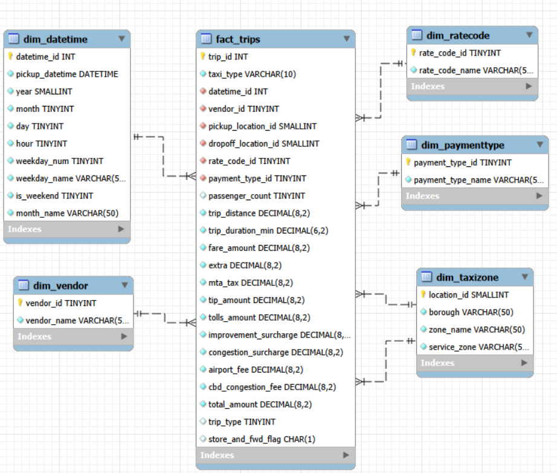
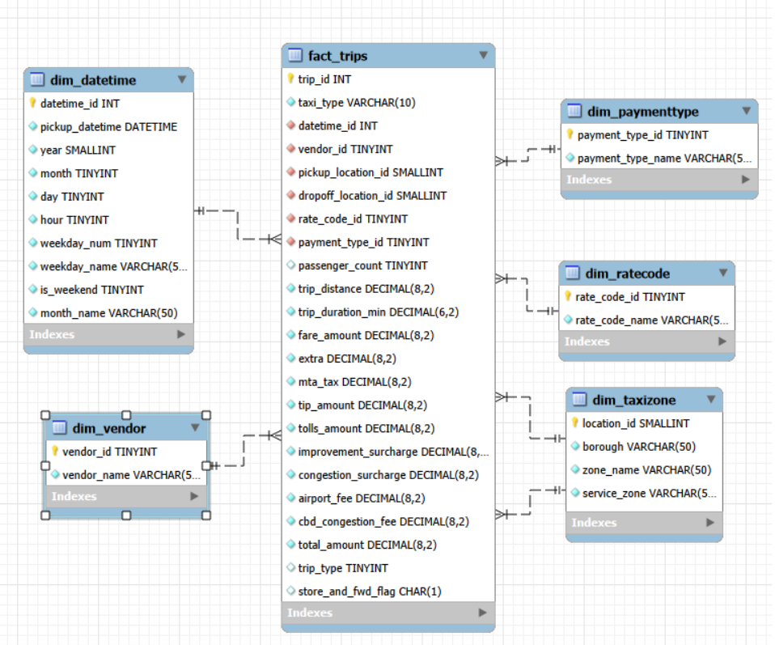

# NYC Taxi SQL Analytics
A Beginner-to-Advanced SQL Project



---

## About This Project

This is a guided SQL project built around one of the most well-known public datasets
in data engineering: the NYC Taxi and Limousine Commission (TLC) trip record data.
If you follow this guide from start to finish, you will end up with a fully functional
star schema database loaded with 51.5 million real taxi trips, and a library of
analytical SQL queries you can add to your own portfolio.

The central business question we are trying to answer is: **What patterns drive NYC
taxi demand, revenue, and rider behavior across time, location, and trip type?**

**Data Source:** [NYC TLC Trip Record Data](https://www.nyc.gov/site/tlc/about/tlc-trip-record-data.page),
publicly available from the NYC Taxi and Limousine Commission.
**Coverage:** Yellow and Green taxi trips, January 2025 to February 2026, 14 months.
**Database:** MySQL star schema (nyc_taxi), 5 dimension tables + 1 fact table.
**Total rows loaded:** ~51.5 million trips (Yellow: ~50.9M, Green: ~636K)

> **Note on database choice:** This project uses MySQL for local development because
> it is the most widely taught database in business analytics programs. In a production
> environment, this workload would typically run on a columnar store such as Snowflake,
> BigQuery, or DuckDB, where analytical queries on 50M+ rows execute in seconds without
> manual indexing.

---

## What You Will Learn

After finishing this project you will be able to:

- Design a star schema with fact and dimension tables
- Write DDL statements to create a relational database from scratch
- Build a Python data pipeline to download, clean, and load raw data into MySQL
- Use foreign keys, indexes, and CHECK constraints properly
- Write analytical SQL queries from basic aggregations to advanced window functions
- Use CTEs (Common Table Expressions) to structure complex queries
- Use window functions including LAG() and RANK()
- Understand the performance tradeoffs between OLTP and OLAP databases

---

## Tools Required

- MySQL Server and MySQL Workbench (free), [Download here](https://dev.mysql.com/downloads/)
- Python 3 with pandas, SQLAlchemy, and pyarrow installed
- Jupyter Notebook or any Python environment

---

## Project Structure

```
NYC-Taxi-SQL-Analytics/
├── screenshots/
│   └── ERD.png
├── load_data.ipynb
├── nyc_taxi_ddl.sql
├── queries.sql
└── README.md
```

---

## Star Schema Design

The database follows a classic star schema with `fact_trips` at the center and five
dimension tables surrounding it.



| Table | Type | Rows | Description |
|---|---|---|---|
| fact_trips | Fact | ~51.5M | One row per taxi trip |
| dim_datetime | Dimension | ~24M | Unique pickup timestamps with date parts |
| dim_taxizone | Dimension | 265 | NYC taxi zones with borough and service area |
| dim_vendor | Dimension | 4 | Taxi technology vendors |
| dim_ratecode | Dimension | 7 | Rate code types (standard, JFK, Newark, etc.) |
| dim_paymenttype | Dimension | 6 | Payment methods (credit card, cash, etc.) |

---

## How the Schema Was Designed

The schema follows the **star schema** pattern, which is the standard design for
analytical databases. The idea is simple: one large fact table at the center stores
every measurable event (in our case, every trip), and smaller dimension tables around
it store the descriptive context (who, where, when, how).

**Why a star schema and not just one big table?**
You could store everything in a single table with columns like `vendor_name`,
`zone_name`, `payment_type_name` repeated on every row. But with 51.5 million rows,
that means storing the string "Credit card" 35 million times instead of just storing
the number 1 and looking it up once in `dim_paymenttype`. The star schema saves
storage, avoids update anomalies, and makes queries cleaner.

**How we chose data types:**
- `TINYINT` for small-range codes (vendor, rate, payment): saves space compared to INT
- `SMALLINT` for zone IDs (max 265 zones)
- `DECIMAL(8,2)` for all financial columns: never use FLOAT for money
- `VARCHAR` only where text length genuinely varies

**Why dim_datetime gets its own table:**
Instead of storing raw timestamps in the fact table and extracting year/month/hour
at query time, we pre-compute those date parts once during loading and store them
in `dim_datetime`. This makes time-based queries much faster and cleaner. You
just filter `WHERE d.year = 2025` instead of `WHERE YEAR(pickup_datetime) = 2025`.

**CHECK constraints and foreign keys:**
Every foreign key column in `fact_trips` has a corresponding constraint that prevents
orphan records. CHECK constraints add a second layer: for example, `taxi_type` can
only be 'yellow' or 'green', and `trip_distance` must be >= 0. This means bad data
gets rejected at the database level, not just in the Python cleaning step.

---

## Step-by-Step Guide

### Step 1 - Create the Database Schema

1. Open MySQL Workbench and connect to your local MySQL server
2. Open `nyc_taxi_ddl.sql`
3. Run the entire file (Ctrl+Shift+Enter)
4. Verify it worked by running:

```sql
USE nyc_taxi;
SHOW TABLES;
```

Expected output: 6 tables listed (dim_datetime, dim_paymenttype, dim_ratecode,
dim_taxizone, dim_vendor, fact_trips)

---

### Step 2 - Load the Data

1. Open `load_data.ipynb` in Jupyter
2. Run Step 0 first. This installs all required packages
3. Create a `.env` file in the same folder with your MySQL password:

```python
with open(".env", "w") as f:
    f.write("MYSQL_PASSWORD=yourpasswordhere\n")
```

Delete this cell after running it. The `.env` file will persist on your machine.

4. Run all steps in order (Step 1 through Step 7)
5. Step 6 loads all 51.5 million rows and will take 30-60 minutes depending on
your machine. Progress is printed after each file.

> **Expected final counts:**
> - Total trips: ~51.5 million
> - Yellow taxi: ~50.9 million
> - Green taxi: ~636,540

---

### Step 3 - Add Performance Indexes

Before running the analytical queries, add this index to speed up joins on the
fact table. Run it once in MySQL Workbench:

```sql
-- Speeds up datetime joins and taxi type filters
ALTER TABLE fact_trips ADD INDEX idx_datetime_taxi (datetime_id, taxi_type);
```

This will take 2-5 minutes to build on 51M rows. You only need to run it once.

---

### Step 4 - Run the Analytical Queries

Open `queries.sql` in MySQL Workbench and run the queries one by one.

> **Before running any queries**, increase the MySQL timeout to avoid connection drops
> on long-running queries:
> 1. Edit -> Preferences -> SQL Editor
> 2. Set "DBMS connection read timeout" to `28800`
> 3. Click OK and close/reopen your connection

---

## A Note on Query Performance

If you run the analytical queries against the full 51.5 million row dataset, expect
some queries to take several minutes even with indexes. This is expected behavior.
MySQL is a row-based transactional database, not a columnar analytics engine.

**Real benchmark result from this project on a local machine:**

| Query | Without Index | With Index |
|---|---|---|
| Trips by month and year | ~1,014 sec (17 min) | ~456 sec (7.5 min) |
| Top 10 zones ranked by revenue | N/A | ~6,989 sec (116 min) |

Even after adding a composite index, a simple aggregation query still takes nearly
2 hours on MySQL. This is not a configuration problem. It is a fundamental limitation
of row-based databases when running aggregations across tens of millions of rows. This
is exactly why columnar databases exist, and why Phase 2 of this project rebuilds the
same queries in a columnar environment.

---

## Key Insights

| Finding | Value | Implication |
|---|---|---|
| Yellow vs Green volume | 50.9M vs 636K trips | Yellow taxis dominate. Green taxis serve outer boroughs only |
| Top pickup zone by trips | Upper East Side South (2.3M trips) | Manhattan's Upper East Side is the busiest taxi market in NYC |
| Top pickup zone by revenue | JFK Airport ($174M) | Airport runs dominate revenue despite lower trip volume |
| Volume vs revenue gap | UES South is 1st in trips but 4th in revenue | Short neighborhood hops generate volume, airport runs generate revenue |
| Most common route | Upper East Side South to Upper East Side North (334K trips) | Short neighborhood hops dominate trip volume |
| Average fare by type | Yellow $20.24, Green $17.68 | Green taxis are cheaper despite longer average distance |
| Average distance by type | Yellow 6.59 mi, Green 19.66 mi | Green taxis serve much longer outer borough trips |
| Peak revenue month (2025) | December ($128M) | Holiday season drives the highest monthly revenue |
| Weakest revenue month (2025) | August ($93M) | Summer slowdown is significant at 27% below December |
| Largest MoM jump | September +24% | Strong post-summer recovery in demand |
| Dominant payment method | Credit card 67.83% of trips | NYC taxis are overwhelmingly cashless |
| Unknown payment type | 21% of trips | Significant data quality gap in payment recording |
| Solo riders | 63% of all trips | Single-passenger trips dominate across all taxi types |
| Data entry errors | Passengers > 6 exist in data | NYC taxis legally carry max 6 passengers. Values above are errors |
| Out-of-range timestamps | ~30 trips from 2007-2009 and 2024 | Likely data entry errors in original TLC source data |

---

## Skills Demonstrated

| Skill | Details |
|---|---|
| Database design | Star schema with 5 dimension tables and 1 fact table |
| DDL | CREATE TABLE, PRIMARY KEY, FOREIGN KEY, CHECK constraints, indexes |
| Data pipeline | Python and pandas to download, clean, and load 51.5M rows into MySQL |
| Basic SQL | SELECT, GROUP BY, ORDER BY, LIMIT, WHERE, JOIN |
| Intermediate SQL | Multi-table joins, subqueries, aggregate functions |
| Advanced SQL | CTEs, window functions (LAG, RANK), percentage calculations |
| Performance tuning | Composite indexes, query optimization, benchmarking |
| Data quality | Identifying and documenting anomalies in real-world data |

---

## Phase 2 - Columnar Database Migration

This project will be rebuilt in a second phase using a columnar database (Snowflake,
BigQuery, or DuckDB) to demonstrate how the same star schema and analytical queries
perform at scale in a purpose-built analytics environment. The same dataset, the same
schema design, and the same queries: but running in seconds instead of minutes.

---

**Alireza Samea**
- Assistant Professor, University Canada West
- Lecturer, Northeastern University Vancouver
- GitHub: [alirezasamea](https://github.com/alirezasamea)
- LinkedIn: [alirezasamea](https://www.linkedin.com/in/alirezasamea/)

---

*Data source: NYC Taxi and Limousine Commission (TLC) Trip Record Data, publicly
available at nyc.gov. Data covers January 2025 to February 2026.*
