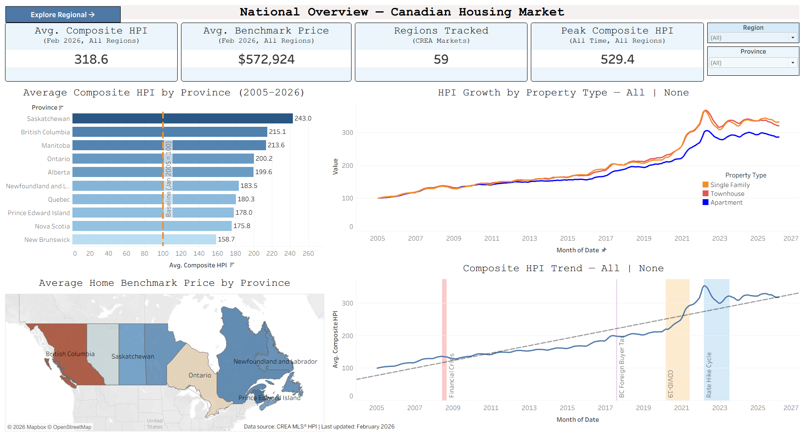
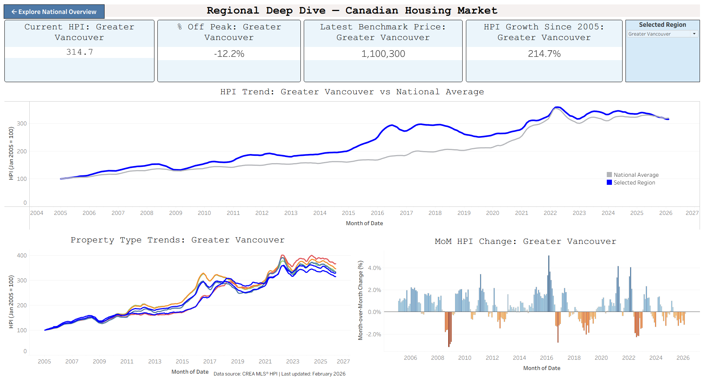

# Canadian Housing Market Dashboard
An Advanced Tableau Project



---

## About This Project

This is an advanced Tableau project built around one of the most discussed policy topics in Canada right now -- housing affordability. If you follow this guide from start to finish, you will end up with a two-dashboard, fully interactive housing market intelligence tool that you can add to your own portfolio.

The central business question we are trying to answer is: **Where have Canadian housing prices grown the fastest, which property types are leading, and what do the trends signal for buyers and policymakers?**

This project covers 20 years of monthly data across 59 regional markets, making it a strong showcase of time-series analysis, geographic visualization, and parameter-driven interactivity -- skills that are in high demand in real analytics roles.

**Dataset:** [CREA MLS Home Price Index](https://www.crea.ca/housing-market-stats/mls-home-price-index/hpi-tool/), publicly available from the Canadian Real Estate Association. Data covers January 2005 to February 2026, 59 regional markets, monthly frequency.

**Live Dashboard:**

[](https://public.tableau.com/app/profile/alireza.samea7416/viz/CanadianHousingMarketIntelligenceDashboardJan2005Feb2026/NationalOverview)

*Click the image to open the interactive dashboard on Tableau Public*

---

## What You Will Learn

After finishing this project you will be able to:

- Reshape multi-sheet Excel data into a flat CSV using Python and pandas
- Connect Tableau to a clean CSV data source
- Build parameters to create dynamic, user-driven views
- Write LOD (Level of Detail) expressions to compute values independent of view filters
- Build dual-axis synchronized line charts
- Use Measure Names and Measure Values to plot multiple metrics on one axis
- Create calculated fields for MoM change using table calculations
- Build dynamic titles that update with parameter selections
- Connect two dashboards with navigation buttons
- Design a pipeline that automatically updates when new data is released

---

## Tools Required

- Tableau Desktop or Tableau Public (free), [Download here](https://public.tableau.com/en-us/s/download)
- Python 3 with pandas and openpyxl installed
- Jupyter Notebook or any Python environment

---

## Project Structure

```
Canadian-Housing-Market/
├── prepare_data.ipynb            
├── Canadian_HPI_Flat.csv         
├── README.md                     
└── screenshots/
    ├── National_Overview.png
    └── Regional_Deep_Dive.png
```

---

## Data Preparation

The CREA dataset is distributed as an Excel file with one sheet per region -- 59 separate sheets that need to be combined into a single flat table before Tableau can use them.

Run `prepare_data.ipynb` to produce `Canadian_HPI_Flat.csv`. The notebook reads every regional sheet, extracts the relevant columns, adds a Region and Province label to each row, and stacks everything into one file with 14,986 rows and 16 columns.

**Output columns:**

| Column | Description |
|--------|-------------|
| Date | Month of observation (YYYY-MM-01) |
| Region | Clean region name (e.g. Greater Vancouver) |
| Province | Two-letter province code (e.g. BC) |
| Composite_HPI | Overall Home Price Index |
| Single_Family_HPI | Detached single family HPI |
| One_Storey_HPI | One-storey detached HPI |
| Two_Storey_HPI | Two-storey detached HPI |
| Townhouse_HPI | Townhouse HPI |
| Apartment_HPI | Apartment HPI |
| Composite_Benchmark | Composite benchmark price in dollars |
| Single_Family_Benchmark | Single family benchmark price in dollars |

> **What is HPI?** The Home Price Index is a relative measure of price change, not an actual dollar price. CREA set January 2005 = 100 for every region. A value of 314.7 for Greater Vancouver means home prices there are 3.147 times higher than they were in January 2005 -- a 214.7% increase. This makes fair comparisons between markets possible regardless of their absolute price levels.

> **Keeping the pipeline up to date:** When CREA releases new monthly data, download the updated Excel file, re-run `prepare_data.ipynb`, and refresh the Tableau data source. Every calculated field, parameter, and KPI card updates automatically because they reference column names rather than hardcoded values. If CREA adds new regions, they will appear in the parameter dropdown with no manual work required.

---

## Dashboard Pages

### Dashboard 1 - National Overview


This is the entry point. It gives a high-level picture of the Canadian housing market across all provinces and property types, with annotated historical context for the major market events of the past 20 years.

**KPI cards:**
- Avg. Composite HPI: 318.6 (Feb 2026, all regions)
- Avg. Benchmark Price: $572,924
- Regions Tracked: 59
- Peak Composite HPI: 529.4 (all-time, all regions)

**Visuals:**
- Bar chart: Average Composite HPI by Province (2005-2026 all-time average, with baseline reference line at 100)
- Choropleth map: Average Benchmark Price by Province
- Multi-line chart: HPI Growth by Property Type nationally (Single Family, Townhouse, Apartment)
- Line chart: Composite HPI Trend 2005-2026 with four annotated event bands -- 2008 Financial Crisis, 2017 BC Foreign Buyer Tax, 2020 COVID-19, 2022 Rate Hike Cycle

**Filters:** Province and Region dropdowns filter all visuals simultaneously.

**Navigation:** "Explore Regional Deep Dive" button links to Dashboard 2.

---

### Dashboard 2 - Regional Deep Dive


This dashboard lets users interrogate any of the 59 regional markets in depth. A single parameter dropdown controls all four visuals and all four KPI cards simultaneously.

**KPI cards (all dynamic):**
- Current HPI -- latest month's composite HPI for the selected region
- % Off Peak -- how far the current HPI sits below the region's all-time high
- Latest Benchmark Price -- most recent benchmark price in dollars
- HPI Growth Since 2005 -- total percentage growth from the January 2005 baseline

**Visuals:**
- Dual-axis line chart: Selected region composite HPI vs national average HPI (2005-2026)
- Multi-line chart: All property type HPI trends for the selected region
- Bar chart: Month-over-month HPI change with blue/orange diverging colors (accessible for color blindness)

**Navigation:** "Explore National Overview" button links back to Dashboard 1.

**Example -- Greater Vancouver:**
- Current HPI: 314.7
- % Off Peak: -12.2% (peak was April 2022 at 358.4)
- Latest Benchmark Price: $1,100,300
- HPI Growth Since 2005: 214.7%

---

## Step-by-Step Guide

### Step 1 - Prepare the Data

1. Download the MLS HPI Excel file from the [CREA HPI Tool](https://www.crea.ca/housing-market-stats/mls-home-price-index/hpi-tool/)
2. Place it in the project folder
3. Open `prepare_data.ipynb` and run all cells
4. Confirm `Canadian_HPI_Flat.csv` is produced in the same folder

---

### Step 2 - Connect Tableau to the CSV

1. Open Tableau Desktop or Tableau Public
2. Connect -> Text File -> select `Canadian_HPI_Flat.csv`
3. In the data source view, confirm Date is recognized as a date field
4. If Date shows as a string, right-click the column header -> Change Data Type -> Date

---

### Step 3 - Create the Parameter

The parameter is the engine of Dashboard 2. It stores the user's selected region and passes it to every calculated field.

1. In the Data pane, right-click in empty space -> Create Parameter
2. Name: `Selected Region`
3. Data type: String
4. Allowable values: List -> Add values from -> Region
5. Click OK

> **Why a parameter instead of a filter?** A filter physically removes rows from the view -- if you filtered to Greater Vancouver, your national average comparison line would also filter down to just Vancouver, which breaks the comparison. A parameter stores a value without touching the data. Your calculated fields then decide what to do with that value, which is why the regional line and the national average line can coexist on the same chart.

---

### Step 4 - Create Calculated Fields

Create all of these before building any visuals. Right-click in the Data pane -> Create Calculated Field for each one.

**Is Selected Region**
```
[Region] = [Selected Region]
```
Returns True for rows matching the selected region, False for all others. Used as a filter on Dashboard 2 visuals.

**National Avg HPI**
```
{ FIXED [Date] : AVG([Composite_HPI]) }
```
Computes the average HPI across all 59 regions for each month, regardless of any filters or parameter selections. This is a Level of Detail (LOD) expression.

> **Understanding LOD expressions:** A regular calculated field computes within whatever context the view currently has. The `FIXED` keyword overrides that -- it says "compute this grouped only by Date, ignoring everything else." This is what keeps the national average line stable while the regional line changes.

**Latest Date**
```
{ FIXED [Region] : MAX([Date]) }
```
Returns the most recent date available for each region. Used to pull current-month KPI values.

**Current HPI**
```
IF [Date] = [Latest Date] THEN [Composite_HPI] END
```

**Current Benchmark**
```
IF [Date] = [Latest Date] THEN [Composite_Benchmark] END
```

**Growth Since 2005**
```
(MAX([Current HPI]) - 100) / 100
```
Since every region started at exactly 100 in January 2005, subtracting 100 gives points gained and dividing by 100 converts to a proportion.

**Peak HPI**
```
{ FIXED [Region] : MAX([Composite_HPI]) }
```

**Pct Off Peak**
```
(MAX([Current HPI]) - MAX([Peak HPI])) / MAX([Peak HPI])
```

**MoM HPI Change**
```
(AVG([Composite_HPI]) - LOOKUP(AVG([Composite_HPI]), -1)) 
/ LOOKUP(AVG([Composite_HPI]), -1)
```
A table calculation that looks back one row to compute the month-over-month percentage change. The first month (January 2005) will return null -- this is expected and correct.

---

### Step 5 - Build Dashboard 1 (National Overview)

**New worksheet: Province HPI Rank**
- Rows: Province
- Columns: AVG(Composite_HPI)
- Mark type: Bar
- Add a reference line at constant value 100 (the 2005 baseline)
- Sort bars descending by AVG(Composite_HPI)

**New worksheet: Province Map**
- Double-click Province -- Tableau auto-generates the map
- Drag Composite_Benchmark to Color
- Set aggregation to AVG
- Choose a sequential color palette

**New worksheet: Property Type Trend**
- Columns: MONTH(Date) continuous
- Rows: Measure Values
- Filter Measure Names to keep only Single_Family_HPI, Townhouse_HPI, Apartment_HPI
- Drag Measure Names to Color

**New worksheet: HPI Trend (with annotations)**
- Columns: MONTH(Date) continuous
- Rows: AVG(Composite_HPI)
- Add four reference bands from the Analytics pane marking the key market events:
  - 2008-2009: Financial Crisis
  - 2016-2017: BC Foreign Buyer Tax
  - 2020-2021: COVID-19
  - 2022-2023: Rate Hike Cycle

**Assemble Dashboard 1**
- Fixed size matching your screen resolution
- KPI cards across the top row
- Bar chart and map in the middle row
- Two line charts in the bottom row
- Province and Region filters applied to all sheets
- Navigation object linking to Dashboard 2

---

### Step 6 - Build Dashboard 2 (Regional Deep Dive)

**New worksheet: Regional Trend**
- Columns: MONTH(Date) continuous
- Rows: AVG(Composite_HPI) and AVG(National Avg HPI)
- Right-click second pill on Rows -> Dual Axis -> Synchronize Axis
- Drag Is Selected Region to Filters -> keep True
- Set regional line to deep blue, national line to gray
- Edit legend title to blank, rename measures to "Selected Region" and "National Average"
- Dynamic title: `HPI Trend: <Parameters.Selected Region> vs National Average`

**New worksheet: Property Type Breakdown**
- Columns: MONTH(Date) continuous
- Rows: Measure Values (all six HPI fields)
- Drag Measure Names to Color and to Filters (keep only the six HPI fields)
- Drag Is Selected Region to Filters -> keep True
- Rename measure aliases to remove "AVG(" prefix
- Set Composite to black to distinguish it as the reference line
- Dynamic title: `Property Type Trends: <Parameters.Selected Region>`

**New worksheet: MoM Change**
- Columns: MONTH(Date) continuous
- Rows: MoM HPI Change
- Mark type: Bar
- Drag MoM HPI Change to Color -> Edit Colors -> Orange-Blue Diverging, centered at 0
- Drag Is Selected Region to Filters -> keep True
- Add reference line at constant 0
- Hide the null indicator (January 2005 has no prior month)
- Dynamic title: `MoM HPI Change: <Parameters.Selected Region>`

**Four KPI worksheets**

For each card: mark type Text, drag Is Selected Region to Filters -> True, format numbers appropriately, write a dynamic title using `<Parameters.Selected Region>`.

| Worksheet | Field | Format |
|-----------|-------|--------|
| KPI - Current HPI | MAX(Current HPI) | Number, 1 decimal |
| KPI - Pct Off Peak | AGG(Pct Off Peak) | Percentage, 1 decimal |
| KPI - Latest Benchmark | MAX(Current Benchmark) | Currency, 0 decimals |
| KPI - Growth 2005 | AGG(Growth Since 2005) | Percentage, 1 decimal |

**Assemble Dashboard 2**
- Four KPI cards across the top row, parameter dropdown in the top right
- Regional Trend chart taking the full middle row
- Property Type Breakdown and MoM Change split side by side in the bottom row
- Navigation object linking back to Dashboard 1
- Right-click Selected Region parameter -> Show Parameter to display the dropdown

---

## Key Insights Summary

| Finding | Value | Implication |
|---------|-------|-------------|
| National composite HPI (Feb 2026) | 318.6 | Prices have more than tripled nationally since 2005 |
| Highest growth province | Saskatchewan | 243.0 all-time average HPI |
| Greater Vancouver growth since 2005 | 214.7% | Market has more than tripled from baseline |
| Greater Vancouver off peak | -12.2% | Peak was April 2022 at HPI 358.4 |
| Peak national composite HPI | 529.4 | Reached during the 2021-2022 COVID surge |
| Apartment vs Single Family gap | Apartments lag significantly in most markets | Detached homes drove the majority of HPI growth nationally |

---

## Skills Demonstrated

| Skill | Details |
|-------|---------|
| Data engineering | Python and pandas to reshape 59-sheet Excel into a flat CSV |
| Parameters | Single dropdown controls all visuals and KPI cards on Dashboard 2 |
| LOD expressions | FIXED expressions for national average and peak HPI independent of view context |
| Table calculations | LOOKUP-based month-over-month percentage change |
| Dual-axis charts | Synchronized regional vs national comparison line |
| Measure Names / Values | Multiple HPI fields plotted as colored lines on one axis |
| Dynamic titles | All chart and card titles update with the parameter selection |
| Geographic visualization | Province choropleth map with benchmark price encoding |
| Dashboard navigation | Two-dashboard system connected with navigation buttons |
| Reproducible pipeline | New CREA data releases require only re-running the notebook and refreshing the data source |

---

## About the Author

**Alireza Samea**
- UBC Sauder Business Intelligence with Power BI Certificate
- Professor and Data Analytics Instructor
- GitHub: [alirezasamea](https://github.com/alirezasamea)
- LinkedIn: [alirezasamea](https://www.linkedin.com/in/alirezasamea/)
- Email: alireza.samea@queensu.ca

---

*Dataset: CREA MLS Home Price Index -- publicly available from the Canadian Real Estate Association. All figures reflect data as of February 2026.*
