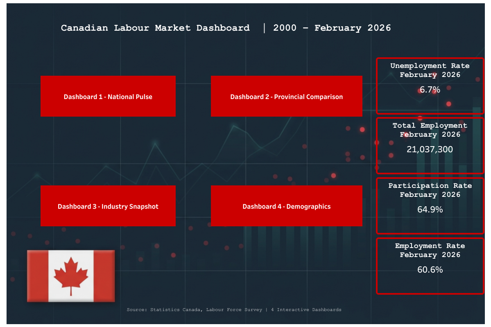

# Canadian Labour Market Dashboard
An Advanced Tableau Project



---

## About This Project

This is an advanced Tableau project built around one of the most important and widely tracked topics in Canadian public policy -- the labour market. If you follow this guide from start to finish, you will end up with a five-page interactive dashboard covering national trends, provincial comparisons, industry employment and wages, and demographic breakdowns.

The central business question we are trying to answer is: **How has Canada's labour market evolved since 2000, which regions and industries lead, and how do age groups experience the market differently?**

This project covers 26 years of monthly data across four Statistics Canada datasets, making it a strong showcase of multi-source data integration, parameter-driven interactivity, and real-world labour market analysis -- skills that are directly relevant to business analytics, policy analysis, and HR roles.

**Dataset:** [Statistics Canada Labour Force Survey](https://www150.statcan.gc.ca), publicly available. Data covers January 2000 to February 2026, monthly frequency.

**Live Dashboard:**

[](https://public.tableau.com/views/CanadianLabourMarketDashboard/CoverPage?:language=en-US&:sid=&:redirect=auth&:display_count=n&:origin=viz_share_link)

*Click the image to open the interactive dashboard on Tableau Public*

---

## What You Will Learn

After finishing this project you will be able to:

- Connect Tableau to multiple CSV data sources from Statistics Canada
- Build context filters to control the base data universe for all calculations
- Create parameters to build user-driven interactive views
- Use the `Line Type` calculated field pattern to keep colors consistent regardless of what the user selects from a parameter
- Use the `Province Filter` calculated field pattern to show a selected value AND a fixed benchmark simultaneously on the same chart
- Build choropleth maps with province-level geographic data
- Add dashboard actions to link map clicks and bar chart clicks to trend line charts
- Build a multi-select industry trend chart using a shown filter with NULL exclusion
- Use calculated fields to cleanly exclude aggregate rows from a shown filter list
- Create a cover page with a background image, live KPI cards, and navigation buttons
- Organize a multi-dashboard workbook with consistent navigation

---

## Key Concepts Glossary

Before building, make sure you understand what these Statistics Canada metrics mean:

**Unemployment Rate** -- the percentage of people in the labour force who are without work and actively looking for a job. A person who has given up looking is not counted as unemployed -- they simply leave the labour force.

**Participation Rate** -- the percentage of the working-age population (15+) that is either employed or actively looking for work. A declining participation rate can signal an aging population or discouraged workers leaving the labour force.

**Employment Rate** -- the percentage of the working-age population (15+) that is currently employed. Unlike the unemployment rate, this includes everyone aged 15+ in the denominator, not just those in the labour force.

**Labour Force** -- the total of employed people plus unemployed people who are actively seeking work. It excludes retirees, students not looking for work, and discouraged workers.

> **Why participation rate matters:** When the participation rate falls and unemployment also falls, it can create a misleading picture. The unemployment rate may look good simply because people stopped looking for work -- not because the economy is truly healthy. Always read unemployment rate and participation rate together.

---

## Tools Required

- Tableau Desktop or Tableau Public (free), [Download here](https://public.tableau.com/en-us/s/download)

---

## Project Structure

```
Canadian-Labour-Market/
├── Dataset/
│   ├── provincial_labour_force.csv
│   ├── demographic_age_groups.csv
│   ├── industry_employment.csv
│   └── wages_by_industry.csv
├── Canadian Labour Market.twb
├── Dashboard cover.png
├── README.md
└── Screenshots/
    ├── Cover_Page.png
    ├── Dashboard 1 - National Pulse.png
    ├── Dashboard 2 - Provincial Comparison.png
    ├── Dashboard 3 - Industry Snapshot.png
    └── Dashboard 4 - Demographics.png
```

---

## Data Sources

All four datasets are publicly available from Statistics Canada's Labour Force Survey at [www150.statcan.gc.ca](https://www150.statcan.gc.ca).

| File | Description |
|------|-------------|
| provincial_labour_force.csv | Employment, unemployment rate, participation rate and employment rate by province, Jan 2000 to Feb 2026, seasonally adjusted |
| demographic_age_groups.csv | Same characteristics broken out by age group (15-24, 25-54, 55+), Canada and provinces, Jan 2000 to Feb 2026 |
| industry_employment.csv | Employment by NAICS industry sector, Canada, Jan 2000 to Feb 2026 |
| wages_by_industry.csv | Average weekly wages by NAICS industry and province, Jan 2001 to Jan 2026 |

---

## Dashboard Pages

### Cover Page


The entry point to the workbook. Shows the project title, date range, four navigation buttons linking to each dashboard, and four live KPI cards showing the most recent February 2026 values: Unemployment Rate (6.7%), Total Employment (21,037,300), Participation Rate (64.9%), and Employment Rate (60.6%).

---

### Dashboard 1 - National Labour Market Pulse


A national-level overview of Canada's labour market from 2000 to February 2026.

**Visuals:**
- Unemployment Rate Trend line chart with four annotated event bands: Dot-com Recession, Global Financial Crisis, COVID-19, Rate Hike Cycle
- Full-time vs Part-time Employment stacked area chart
- Labour Force Participation Rate trend line
- Four KPI cards: Unemployment Rate, Employment Rate, Participation Rate, Total Employment (all February 2026 values)

**Key insights:**
- Unemployment peaked at ~14% during COVID-19 in May 2020 and recovered to 6.7% by February 2026
- Full-time employment grew from ~14M to ~17M workers while part-time remained relatively stable
- Participation rate declined from a peak of ~67.5% in 2008 to 64.9% today, reflecting an aging population

---

### Dashboard 2 - Provincial Comparison


A geographic and trend comparison of unemployment rates across Canada's 10 provinces.

**Visuals:**
- Choropleth map: Average unemployment rate by province (color-encoded red = high, green = low)
- Bar chart: Provinces ranked by average unemployment rate
- Trend line: Selected province vs Canada national average (2000-2026)
- Select Province parameter dropdown with dashboard action linking map and bar chart clicks to the trend line

**Key insights:**
- Newfoundland and Labrador has the highest average unemployment rate at 13.7% over the full period
- Saskatchewan and Alberta consistently have the lowest rates at 5.3% and 5.9%
- British Columbia has tracked below the national average for most of the past 25 years

**Tableau techniques highlighted:**

> **Province Filter calculated field:** To show the selected province AND the Canada national line simultaneously on the same chart, create a calculated field:
> ```
> [GEO] = [Select Province] OR [GEO] = "Canada"
> ```
> This keeps both rows in the view without filtering one out. A regular filter on GEO would remove Canada from the data entirely when a province is selected.

> **Line Type calculated field:** When using a parameter to select a province, Tableau assigns colors by dimension member -- meaning British Columbia might be blue today and a different shade when you switch to Ontario. To lock the colors so Canada is always red and the selected province is always blue regardless of which province is chosen, create this calculated field:
> ```
> IF [GEO] = "Canada" THEN "Canada"
> ELSE "Selected Province"
> END
> ```
> Then drag `Line Type` to the Color mark instead of `GEO`. Now you only have two color categories and they never change.

---

### Dashboard 3 - Industry Snapshot


A side-by-side view of employment size and weekly wages across 16 NAICS industries, plus an interactive trend chart.

**Visuals:**
- Employment by Industry bar chart: Average employment headcount per industry (2000-2026)
- Wages by Industry bar chart: Average weekly wages per industry (2001-2026)
- Industry Employment Trends multi-line chart: Select multiple industries from the checklist to compare their employment trends over time

**Key insights:**
- Wholesale and Retail Trade is the largest employer at ~2.7M workers on average
- Mining and Utilities are the highest-paying industries at ~$1,800/week average
- Accommodation and Food Services is the lowest-paying at ~$625/week -- a nearly 3x wage gap with Mining
- Health Care employment has grown steadily from ~1.5M to ~3M workers over 25 years

**Tableau techniques highlighted:**

> **Excluding aggregate rows from a shown filter:** The Statistics Canada NAICS data includes aggregate rows like "Total employed, all industries" and "Goods-producing sector" alongside the 16 individual industries. If you show a filter on the NAICS field, these aggregates appear in the list and confuse viewers. The clean solution is to create a calculated field:
> ```
> IF [NAICS] = "Goods-producing sector"
> OR [NAICS] = "Services-producing sector"
> OR [NAICS] = "Total employed, all industries"
> THEN NULL
> ELSE [NAICS]
> END
> ```
> Name it `Industry Name`. Drag this to the Color mark and show its filter instead of the raw NAICS field. The NULL values can then be hidden from the filter list via right-click on the filter → Customize → uncheck Show Null Values.

---

### Dashboard 4 - Demographics and Age Groups


A demographic breakdown of Canada's labour market showing how youth, prime-age, and senior workers experience the market differently.

**Visuals:**
- Unemployment Rate by Age Group trend chart: Three lines (15-24 in red, 25-54 in blue, 55+ in green) from 2000 to 2026
- Participation Rate by Age Group trend chart: Shows the structural rise in senior participation and decline in youth participation
- Age Group Snapshot bar chart: February 2026 unemployment rate for each age group side by side

**Key insights:**
- Youth unemployment (15-24) is consistently 2-3x higher than prime-age (25-54) -- 14.1% vs 5.7% in February 2026
- Senior participation rate (55+) rose from ~26% in 2000 to ~37% today, reflecting Baby Boomers working longer
- COVID-19 hit youth workers hardest -- their unemployment rate spiked to ~30% in May 2020 vs ~12% for prime-age workers

---

## Step-by-Step Build Guide

### Step 1 - Connect the Data Sources

1. Open Tableau Desktop or Tableau Public
2. Connect to Text file → select `provincial_labour_force.csv`
3. In the Data Source tab, change the `Ref Date` column type from Abc (string) to Date
4. Click Go to Worksheet
5. Repeat steps 2-4 for each of the remaining three CSV files -- each becomes a separate data source in your workbook

> **Important:** After connecting each new data source, save your workbook to Tableau Public immediately before building any sheets. Tableau Public requires all data to be embedded as extracts. Connecting a new live CSV source and then saving without extracting first can cause disconnection errors. Save early and often.

---

### Step 2 - Build Dashboard 1 (National Pulse)

**Set up context filters on each sheet (apply to all Dashboard 1 sheets):**
- Drag `Data type` to Filters → select Seasonally adjusted → right-click → Add to Context
- Drag `Statistics` to Filters → select Estimate → right-click → Add to Context
- Drag `GEO` to Filters → select Canada only → right-click → Add to Context

> **Why context filters?** The provincial_labour_force file stores all metrics in a single `Value` column distinguished only by the `Labour force characteristics` column. Without context filters locking in Canada + Seasonally adjusted + Estimate, calculations can bleed across categories and return wrong values.

**Sheet: Unemployment Rate Trend**
1. Drag `Ref Date` to Columns → right-click → Exact Date
2. Drag `Value` to Rows → change aggregation to AVG
3. Drag `Labour force characteristics` to Filters → select Unemployment rate
4. Change line color to `#CC0000`
5. From the Analytics pane, add Reference Bands for the four economic events:
   - Dot-com Recession: 2001-03 to 2002-12, color `#E8DAEF`
   - Global Financial Crisis: 2008-09 to 2009-10, color `#FADBD8`
   - COVID-19: 2020-03 to 2021-09, color `#FDEBD0`
   - Rate Hike Cycle: 2022-03 to 2023-07, color `#D6EAF8`

**Sheet: Employment Trend**
1. Duplicate the Unemployment Rate Trend sheet
2. Edit the Labour force characteristics filter → select Full-time employment and Part-time employment
3. Drag `Labour force characteristics` to the Color mark
4. Change mark type to Area
5. Set colors: Full-time → `#2E86C1`, Part-time → `#F39C12`

**Sheet: Participation Rate Trend**
1. Duplicate the Unemployment Rate Trend sheet
2. Edit the Labour force characteristics filter → select Participation rate
3. Fix y-axis minimum to 58 so the variation is clearly visible

**KPI Cards (4 sheets)**
For each KPI, duplicate the Unemployment Rate Trend sheet and:
1. Remove `Ref Date` from Columns
2. Add a `Ref Date` filter → Range of Dates → set start and end to 2026-02-01
3. Change mark type to Text
4. Edit the Labour force characteristics filter to the relevant metric
5. Format rates using Custom number format `0.0""%""` and employment headcount using Number Standard

**Assemble Dashboard 1**
- Fixed size 1200 x 800
- KPI cards in a horizontal container at the top
- Employment Trend and Participation Rate charts side by side in the middle
- Unemployment Rate Trend full width at the bottom

---

### Step 3 - Build Dashboard 2 (Provincial Comparison)

**Create the Select Province parameter:**
1. Right-click in the Data pane → Create Parameter
2. Name: `Select Province`, Data type: String, Allowable values: List
3. Add all 10 province names
4. Default value: Ontario

**Create calculated fields:**

`Province Filter`
```
[GEO] = [Select Province] OR [GEO] = "Canada"
```

`Line Type`
```
IF [GEO] = "Canada" THEN "Canada"
ELSE "Selected Province"
END
```

**Sheet: Province Map**
1. Right-click `GEO` in Data pane → Geographic Role → State/Province
2. Double-click `GEO` to generate the map
3. Drag `Value` to Color → AVG
4. Add context filters: Data type (Seasonally adjusted), Statistics (Estimate), GEO (all provinces, exclude Canada), Labour force characteristics (Unemployment rate)
5. Choose a Red-Green diverging color palette, reversed so red = high unemployment

**Sheet: Province Bar Chart**
1. Drag `GEO` to Rows, `Value` to Columns → AVG
2. Same filters as Province Map
3. Sort descending by AVG Value
4. Color `#CC0000`

**Sheet: Province Trend**
1. Drag `Ref Date` to Columns → Exact Date
2. Drag `Value` to Rows → AVG
3. Filters: Data type, Statistics, Labour force characteristics (Unemployment rate), GEO (all provinces + Canada)
4. Drag `Province Filter` to Filters → keep True
5. Drag `Line Type` to Color mark
6. Set colors: Canada → `#CC0000`, Selected Province → `#2E86C1`
7. Right-click the parameter → Show Parameter
8. Dynamic title: `<Parameters.Select Province> vs. Canada: Unemployment Rate (2000-Feb. 2026)`

**Add dashboard actions:**
- Dashboard menu → Actions → Change Parameter: Source = Province Map + Province Bar Chart, Target = Select Province, Field = GEO
- Dashboard menu → Actions → Highlight: Source = Province Map, Target = Province Bar Chart, Field = GEO

---

### Step 4 - Build Dashboard 3 (Industry Snapshot)

Connect to `industry_employment.csv` as a new data source.

**Employment (Actual) calculated field:**
```
AVG([Value]) * 1000
```
This converts the Stats Canada thousands notation to actual worker counts.

**Sheet: Industry Employment**
1. Context filters: Statistics (Estimate), NAICS (deselect Total employed all industries, Goods-producing sector, Services-producing sector)
2. Drag `NAICS` to Rows, `Employment (Actual)` to Columns
3. Sort descending, color `#2E86C1`

Connect to `wages_by_industry.csv` as a separate data source.

**Sheet: Wages by Industry**
1. Context filters: GEO (Canada), Overtime (Including overtime), NAICS (deselect aggregate rows)
2. Drag `NAICS` to Rows, `AVG(Value)` to Columns
3. Sort descending, color `#E67E22`

**Sheet: Industry Trend**
1. Create the `Industry Name` calculated field (see technique note in dashboard description above)
2. Drag `Ref Date` to Columns → Exact Date
3. Drag `Employment (Actual)` to Rows
4. Drag `Industry Name` to Color mark → Show Filter
5. Right-click the shown filter → Customize → uncheck Show Null Values

---

### Step 5 - Build Dashboard 4 (Demographics)

Connect to `demographic_age_groups.csv` as a new data source.

**Context filters on all demographic sheets:**
- GEO → Canada
- Statistics → Estimate
- Data type → Seasonally adjusted

**Sheet: Youth vs Prime Age Trend**
1. Drag `Ref Date` to Columns → Exact Date
2. Drag `Value` to Rows → AVG
3. Filter `Labour force characteristics` → Unemployment rate
4. Filter `Age group` → keep 15 to 24 years, 25 to 54 years, 55 years and over
5. Drag `Age group` to Color mark
6. Set colors: 15 to 24 years → `#CC0000`, 25 to 54 years → `#2E86C1`, 55 years and over → `#27AE60`

**Sheet: Participation Rate by Age Group**
1. Duplicate Youth vs Prime Age Trend
2. Edit Labour force characteristics filter → Participation rate
3. Fix y-axis minimum to 20

**Sheet: Age Group Snapshot**
1. Duplicate Youth vs Prime Age Trend
2. Remove `Ref Date` from Columns, drag `Age group` to Columns
3. Add `Ref Date` filter → Range of Dates → 2026-02-01 to 2026-02-01
4. Change mark type to Bar, drag `Age group` to Color

---

### Step 6 - Build the Cover Page

1. New Dashboard → rename Cover Page → set size to Automatic
2. Switch to Floating mode
3. Drag an Image object → select your background image → Fit Image → Send to Back
4. Add a Text object for the title
5. For each KPI card: duplicate the original KPI sheet → Format → Shading → set Worksheet and Pane to None (transparent) → Format → Font → set color to White → drag onto the cover
6. Drag Navigation objects for each dashboard → style and label them

---

## Key Insights Summary

| Finding | Value | Implication |
|---------|-------|-------------|
| National unemployment (Feb 2026) | 6.7% | Slightly above post-COVID low of 4.9% in late 2022 |
| Highest provincial unemployment | Newfoundland 13.7% | Atlantic provinces consistently lag Prairie provinces |
| Youth vs prime-age unemployment gap | 14.1% vs 5.7% | Youth face 2.5x higher unemployment rate |
| Highest paying industry | Mining ~$1,808/week | Nearly 3x higher than Accommodation and Food |
| COVID unemployment peak | ~14% national, ~30% youth | Youth bore the largest share of COVID labour market shock |
| Senior participation rate rise | 26% to 37% (2000-2026) | Aging workforce delaying retirement |

---

## Skills Demonstrated

| Skill | Details |
|-------|---------|
| Multi-source workbook | Four separate Statistics Canada data sources |
| Context filters | Base universe filtering on all sheets |
| Parameters | Province selection driving trend line and chart titles |
| Dashboard actions | Map and bar chart clicks update province parameter |
| Calculated fields | Line Type, Province Filter, Industry Name, Employment (Actual) |
| Choropleth map | Province-level unemployment rate encoding |
| Multi-select shown filter | Industry trend comparison with NULL exclusion |
| Reference bands | Four annotated economic event bands |
| Dynamic titles | Trend chart titles update with parameter selection |
| Cover page | Background image, live KPI cards, navigation buttons |

---

## About the Author

**Alireza Samea**
- UBC Sauder Business Intelligence with Power BI Certificate
- Professor and Data Analytics Instructor
- GitHub: [alirezasamea](https://github.com/alirezasamea)
- LinkedIn: [alirezasamea](https://www.linkedin.com/in/alirezasamea/)
- Email: alireza.samea@queensu.ca

---

*Dataset: Statistics Canada, Labour Force Survey. All data publicly available at www150.statcan.gc.ca. Figures reflect data as of February 2026.*
